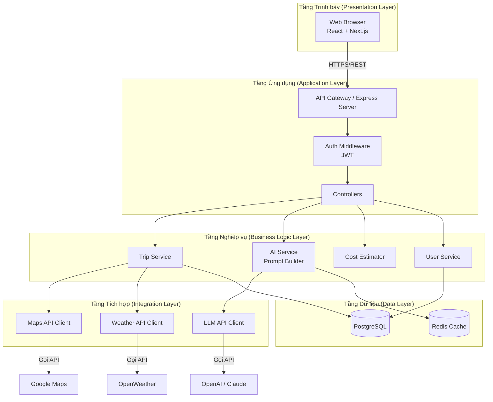
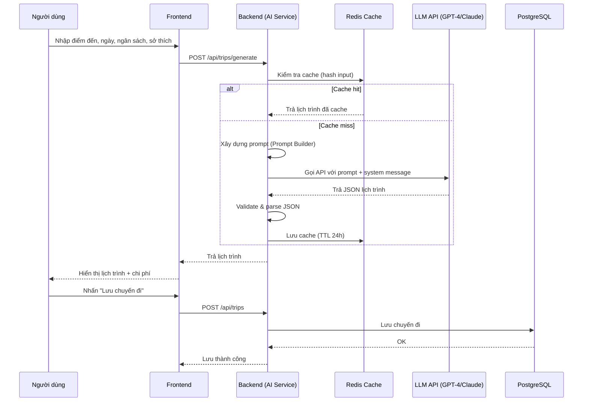
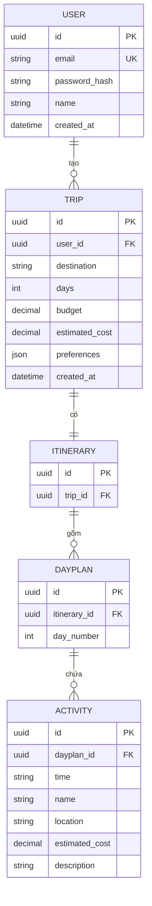
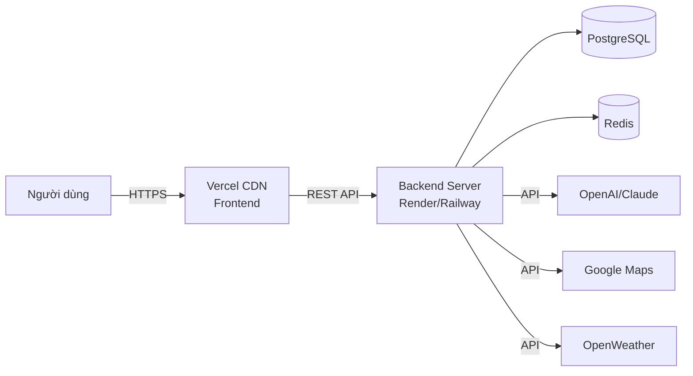

# 3.6 Kiến trúc & Công nghệ (Technical Architecture & Technology Stack)

> **Dự án:** TripMind AI – Ứng dụng lập kế hoạch du lịch thông minh bằng AI
> **Môn học:** Chuyên đề 4: AI Product Development
> **Nền tảng:** Web application (responsive)
> **Phiên bản tài liệu:** 1.0
> **Ngày cập nhật:** 08/09/2026

---

## 1. Mục đích

Tài liệu này mô tả kiến trúc kỹ thuật, công nghệ sử dụng, cách phân tầng hệ thống,
các API tích hợp và đặc biệt là **cách tích hợp AI (LLM)** vào sản phẩm TripMind AI.
Đây là tài liệu nền tảng cho giai đoạn phát triển, giúp nhóm kỹ thuật thống nhất về
công nghệ và cách các thành phần tương tác với nhau.

---

## 2. Công nghệ sử dụng (Technology Stack)

### 2.1. Bảng tổng hợp

| Tầng | Công nghệ | Lý do lựa chọn |
|------|-----------|----------------|
| **Frontend** | React 18 + Next.js 14 | SSR/SSG tốt cho SEO, hệ sinh thái lớn, dễ triển khai |
| **Ngôn ngữ** | TypeScript | An toàn kiểu dữ liệu, giảm lỗi runtime |
| **Giao diện** | Tailwind CSS + shadcn/ui | Phát triển UI nhanh, responsive dễ dàng |
| **Backend** | Node.js + Express | Nhẹ, phù hợp REST API, cùng ngôn ngữ với frontend |
| **Cơ sở dữ liệu** | PostgreSQL | Dữ liệu quan hệ (User, Trip, Itinerary), truy vấn mạnh |
| **Cache** | Redis | Cache kết quả AI, giảm chi phí gọi API, tăng tốc độ |
| **AI / LLM** | OpenAI GPT-4 API hoặc Anthropic Claude API | Sinh nội dung lịch trình chất lượng cao |
| **Xác thực** | JWT + bcrypt | Xác thực stateless, mã hóa mật khẩu an toàn |
| **ORM** | Prisma | Truy vấn type-safe, migration dễ quản lý |
| **Triển khai** | Vercel (FE) + Render/Railway (BE) | Miễn phí/giá rẻ cho MVP, CI/CD tích hợp sẵn |
| **Container** | Docker | Đóng gói môi trường nhất quán |
| **Kiểm thử** | Jest + React Testing Library | Kiểm thử unit và component |

### 2.2. API bên thứ ba (Third-party APIs)

| API | Mục đích sử dụng | Bắt buộc |
|-----|------------------|----------|
| **OpenAI / Claude API** | Sinh lịch trình du lịch bằng AI (chức năng lõi) | Có |
| **Google Maps API** | Lấy tọa độ, khoảng cách, bản đồ địa điểm | Có |
| **OpenWeather API** | Dự báo thời tiết tại điểm đến | Nên có |
| **Unsplash API** | Lấy hình ảnh minh họa cho địa điểm | Tùy chọn |
| **SendGrid / Nodemailer** | Gửi email (khôi phục mật khẩu) | Nên có |

---

## 3. Kiến trúc phân tầng (Layered Architecture)

TripMind AI áp dụng kiến trúc **phân tầng (N-tier / Layered Architecture)** để tách
biệt trách nhiệm, dễ bảo trì và mở rộng.

### 3.1. Sơ đồ kiến trúc tổng thể



### 3.2. Mô tả từng tầng

| Tầng | Trách nhiệm | Thành phần |
|------|-------------|------------|
| **Presentation** | Giao diện người dùng, hiển thị, tương tác | React components, pages, UI state |
| **Application** | Điều phối request, xác thực, định tuyến | Express routes, middleware, controllers |
| **Business Logic** | Xử lý nghiệp vụ cốt lõi | Trip Service, AI Service, Cost Estimator |
| **Integration** | Giao tiếp với dịch vụ bên ngoài | LLM Client, Maps Client, Weather Client |
| **Data** | Lưu trữ và truy xuất dữ liệu | PostgreSQL, Redis, Prisma ORM |

### 3.3. Nguyên tắc thiết kế

- **Separation of Concerns:** Mỗi tầng chỉ giao tiếp với tầng liền kề.
- **Dependency Injection:** Các service nhận phụ thuộc qua constructor để dễ test.
- **Provider-agnostic AI:** Tầng tích hợp AI được trừu tượng hóa để dễ thay đổi
  nhà cung cấp (OpenAI ↔ Claude) mà không ảnh hưởng nghiệp vụ.

---

## 4. Tích hợp AI (AI Integration)

> Đây là phần trọng tâm vì TripMind AI là sản phẩm **AI-first**.

### 4.1. Luồng xử lý tạo lịch trình bằng AI



### 4.2. Kỹ thuật Prompt Engineering

Hệ thống dùng **structured prompting** để đảm bảo AI trả về dữ liệu đúng định dạng JSON.

**System prompt (định hướng vai trò AI):**

```
Bạn là một chuyên gia lập kế hoạch du lịch. Nhiệm vụ của bạn là tạo lịch trình
du lịch chi tiết, thực tế và tối ưu chi phí dựa trên thông tin người dùng cung cấp.
Luôn trả về kết quả dưới dạng JSON đúng cấu trúc được yêu cầu, không thêm văn bản
giải thích bên ngoài JSON.
```

**User prompt (được sinh động từ input):**

```
Hãy tạo lịch trình du lịch với thông tin sau:
- Điểm đến: {destination}
- Số ngày: {days}
- Ngân sách: {budget} VND
- Sở thích: {preferences}

Yêu cầu:
1. Lịch trình chia theo từng ngày.
2. Mỗi hoạt động gồm: thời gian, tên, địa điểm, chi phí ước tính.
3. Tổng chi phí không vượt quá ngân sách.
4. Trả về đúng định dạng JSON theo schema đã cho.
```

### 4.3. Chiến lược tối ưu chi phí & độ tin cậy AI

| Vấn đề | Giải pháp |
|--------|-----------|
| Chi phí gọi API cao | Cache kết quả bằng Redis (hash input), TTL 24h |
| AI trả JSON sai định dạng | Validate schema + retry (tối đa 2 lần) + fallback |
| AI "bịa" thông tin (hallucination) | Kết hợp Google Maps API để xác minh địa điểm |
| Thời gian phản hồi lâu | Streaming response, hiển thị loading rõ ràng |
| Rate limit của LLM | Hàng đợi (queue) + giới hạn request/người dùng |

### 4.4. Xử lý lỗi AI (AI Error Handling)

| Tình huống | Xử lý |
|------------|-------|
| Timeout (> 15s) | Hủy request, thông báo "Thử lại" |
| Vượt rate limit | Đưa vào hàng đợi, thông báo chờ |
| JSON không hợp lệ | Retry với prompt nhấn mạnh định dạng |
| API key hết hạn/lỗi | Log lỗi, thông báo lỗi hệ thống |

---

## 5. Thiết kế API (API Design)

TripMind AI cung cấp **RESTful API**. Dưới đây là các endpoint chính.

### 5.1. Nhóm xác thực (Authentication)

| Method | Endpoint | Mô tả | Xác thực |
|--------|----------|-------|----------|
| POST | `/api/auth/register` | Đăng ký tài khoản | Không |
| POST | `/api/auth/login` | Đăng nhập, trả JWT | Không |
| POST | `/api/auth/logout` | Đăng xuất | Có |
| POST | `/api/auth/forgot-password` | Gửi email khôi phục | Không |

### 5.2. Nhóm chuyến đi (Trips)

| Method | Endpoint | Mô tả | Xác thực |
|--------|----------|-------|----------|
| POST | `/api/trips/generate` | Sinh lịch trình bằng AI | Có |
| POST | `/api/trips` | Lưu chuyến đi | Có |
| GET | `/api/trips` | Lấy danh sách chuyến đi của user | Có |
| GET | `/api/trips/:id` | Lấy chi tiết một chuyến đi | Có |
| PUT | `/api/trips/:id` | Cập nhật/chỉnh sửa lịch trình | Có |
| DELETE | `/api/trips/:id` | Xóa chuyến đi | Có |
| GET | `/api/trips/:id/export` | Xuất PDF lịch trình | Có |

### 5.3. Ví dụ Request / Response

**Request:** `POST /api/trips/generate`

```json
{
  "destination": "Đà Lạt",
  "days": 3,
  "budget": 3000000,
  "preferences": ["thiên nhiên", "ẩm thực", "check-in"]
}
```

**Response:** `200 OK`

```json
{
  "success": true,
  "data": {
    "destination": "Đà Lạt",
    "days": 3,
    "budget": 3000000,
    "estimated_cost": 2750000,
    "within_budget": true,
    "itinerary": [
      {
        "day": 1,
        "activities": [
          {
            "time": "08:00",
            "name": "Tham quan Hồ Xuân Hương",
            "location": "Trung tâm Đà Lạt",
            "estimated_cost": 0
          }
        ]
      }
    ]
  }
}
```

**Response lỗi:** `400 Bad Request`

```json
{
  "success": false,
  "error": {
    "code": "INVALID_INPUT",
    "message": "Số ngày phải nằm trong khoảng 1–30."
  }
}
```

---

## 6. Mô hình cơ sở dữ liệu (Database Schema)

### 6.1. Sơ đồ quan hệ thực thể (ERD)



### 6.2. Mô tả bảng

| Bảng | Mô tả | Khóa chính | Khóa ngoại |
|------|-------|-----------|------------|
| `users` | Thông tin tài khoản người dùng | id | – |
| `trips` | Thông tin chuyến đi | id | user_id → users |
| `itineraries` | Lịch trình của chuyến đi | id | trip_id → trips |
| `day_plans` | Kế hoạch từng ngày | id | itinerary_id → itineraries |
| `activities` | Hoạt động trong ngày | id | dayplan_id → day_plans |

---

## 7. Bảo mật (Security)

| Khía cạnh | Biện pháp |
|-----------|-----------|
| Mật khẩu | Hash bằng bcrypt (không lưu plaintext) |
| Xác thực | JWT với thời hạn token + refresh token |
| Truyền dữ liệu | HTTPS/TLS bắt buộc |
| Phân quyền | Kiểm tra quyền sở hữu (user chỉ truy cập dữ liệu của mình) |
| API key | Lưu trong biến môi trường (.env), không commit lên Git |
| Input validation | Validate & sanitize toàn bộ input (chống injection) |
| Rate limiting | Giới hạn số request/IP để chống lạm dụng |

---

## 8. Khả năng mở rộng & Hiệu năng (Scalability & Performance)

| Kỹ thuật | Mục đích |
|----------|----------|
| **Redis cache** | Giảm số lần gọi LLM API, tăng tốc độ phản hồi |
| **Stateless backend** | Dễ scale ngang (horizontal scaling) |
| **Database indexing** | Tăng tốc truy vấn danh sách chuyến đi |
| **CDN (Vercel)** | Phân phối tài nguyên tĩnh nhanh |
| **Queue cho AI request** | Kiểm soát tải khi nhiều người dùng đồng thời |

---

## 9. Sơ đồ triển khai (Deployment Diagram)



---

## 10. Kết luận

Tài liệu kiến trúc đã xác định rõ công nghệ sử dụng, cách phân tầng hệ thống theo mô
hình Layered Architecture, thiết kế API RESTful, mô hình dữ liệu và đặc biệt là chiến
lược tích hợp AI (prompt engineering, caching, xử lý lỗi, chống hallucination). Kiến
trúc được thiết kế theo hướng **AI-first**, dễ mở rộng và dễ thay thế nhà cung cấp AI,
phù hợp với định hướng của môn học *Chuyên đề 4: AI Product Development*.
