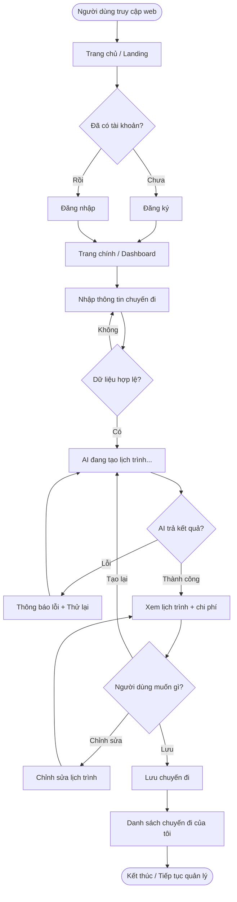
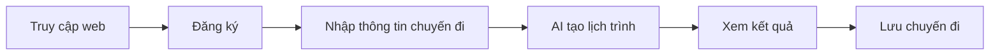
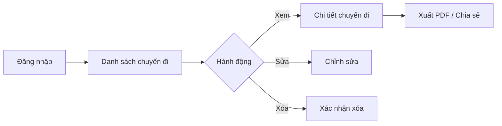
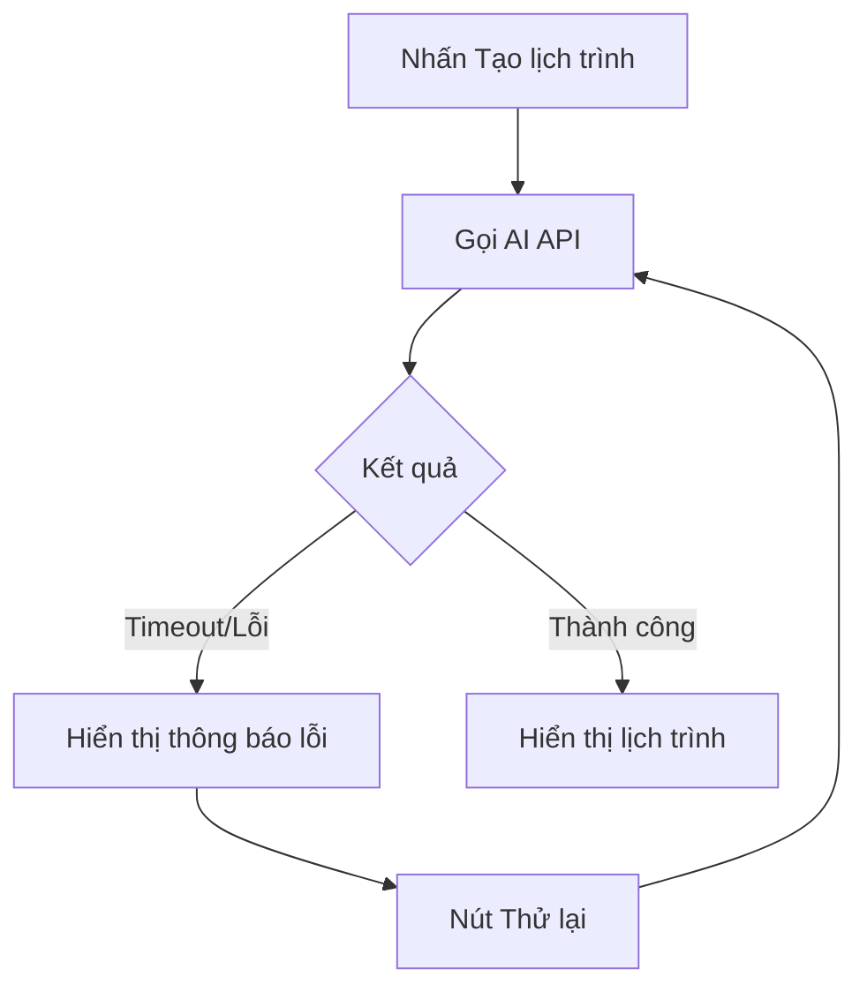

# 4.1 Luồng Người dùng (User Flow)

> **Dự án:** TripMind AI – Ứng dụng lập kế hoạch du lịch thông minh bằng AI
> **Môn học:** Chuyên đề 4: AI Product Development
> **Chương:** 4 – AI trong Thiết kế Sản phẩm
> **Phiên bản tài liệu:** 1.0
> **Ngày cập nhật:** 15/09/2026

---

## 1. Mục đích

Tài liệu này mô tả **luồng người dùng (User Flow)** của TripMind AI — tức trình tự
các bước và màn hình mà người dùng đi qua để hoàn thành các mục tiêu chính. User Flow
là nền tảng cho việc thiết kế wireframe (4.2) và prototype (4.3), giúp đảm bảo trải
nghiệm mạch lạc, không bị "lạc đường".

---

## 2. Sơ đồ luồng tổng thể (Overall User Flow)

---

## 3. Các luồng chính (Primary Flows)

### 3.1. Luồng 1: Người dùng mới tạo lịch trình đầu tiên

**Mô tả từng bước:**

| Bước | Màn hình | Hành động của người dùng | Phản hồi hệ thống |
|------|----------|--------------------------|-------------------|
| 1 | Trang chủ | Nhấn "Bắt đầu" | Chuyển đến trang đăng ký |
| 2 | Đăng ký | Nhập email + mật khẩu | Tạo tài khoản, vào Dashboard |
| 3 | Tạo chuyến đi | Nhập điểm đến, ngày, ngân sách, sở thích | Kích hoạt nút "Tạo lịch trình" |
| 4 | Loading | Chờ AI xử lý | Hiển thị trạng thái loading |
| 5 | Kết quả | Xem lịch trình theo ngày | Hiển thị lịch trình + chi phí |
| 6 | Kết quả | Nhấn "Lưu" | Lưu và thông báo thành công |

### 3.2. Luồng 2: Người dùng cũ quản lý chuyến đi

### 3.3. Luồng 3: Xử lý lỗi khi AI thất bại

---

## 4. Bản đồ màn hình (Screen Map)

| Mã | Màn hình | Từ màn hình nào tới | Đi tới màn hình nào |
|----|----------|---------------------|---------------------|
| S1 | Trang chủ (Landing) | – | S2, S3 |
| S2 | Đăng ký | S1 | S4 |
| S3 | Đăng nhập | S1 | S4 |
| S4 | Dashboard | S2, S3 | S5, S8 |
| S5 | Tạo chuyến đi | S4 | S6 |
| S6 | Kết quả lịch trình | S5 | S7, S8 |
| S7 | Chỉnh sửa lịch trình | S6, S9 | S6 |
| S8 | Danh sách chuyến đi | S4, S6 | S9 |
| S9 | Chi tiết chuyến đi | S8 | S7 |

---

## 5. Điểm quyết định & Điểm rời bỏ (Decision & Drop-off Points)

| Điểm | Mô tả | Rủi ro rời bỏ | Giải pháp thiết kế |
|------|-------|---------------|--------------------|
| Đăng ký | Người dùng ngại tạo tài khoản | Cao | Cho phép dùng thử trước khi đăng ký (giai đoạn sau) |
| Nhập thông tin | Form quá dài/phức tạp | Trung bình | Form tối giản, chỉ 4 trường |
| Chờ AI | Thời gian chờ lâu | Trung bình | Loading rõ ràng, hiển thị tiến trình |
| Kết quả không ưng ý | Lịch trình chưa phù hợp | Trung bình | Nút "Tạo lại" + cho phép chỉnh sửa |

---

## 6. Kết luận

User Flow của TripMind AI được thiết kế **ngắn gọn, tập trung vào chức năng lõi**
(tạo lịch trình bằng AI). Số bước từ lúc vào web đến khi có lịch trình được tối
thiểu hóa, đồng thời có các luồng phụ xử lý lỗi và quản lý chuyến đi. Đây là cơ sở
để xây dựng wireframe ở mục 4.2.
