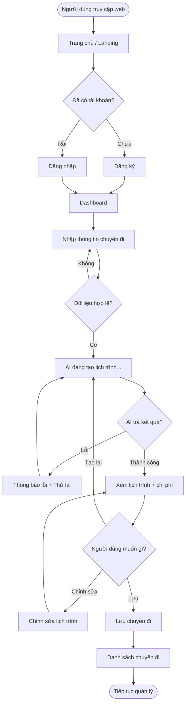
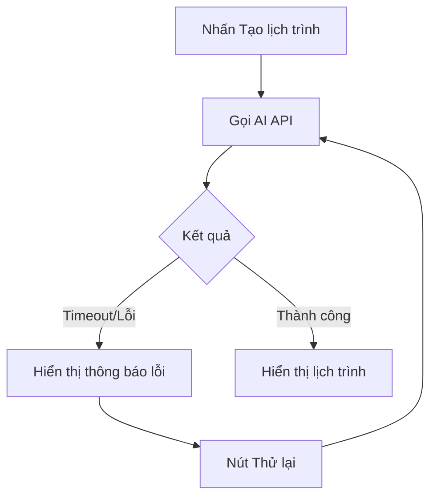

# PRD: Luồng Người dùng (User Flow)

> **Dự án:** TripMind AI – Ứng dụng lập kế hoạch du lịch thông minh bằng AI
> **Môn học:** Chuyên đề 4: AI Product Development
> **Chương:** 4 – AI trong Thiết kế Sản phẩm · Mục 4.1
> **Phiên bản:** 1.0 · **Ngày cập nhật:** 15/09/2026

## Introduction

Thiết kế **luồng người dùng (User Flow)** cho TripMind AI để định nghĩa rõ trình tự
các bước và màn hình mà người dùng đi qua nhằm hoàn thành mục tiêu chính: tạo và quản
lý lịch trình du lịch bằng AI. User Flow là nền tảng cho wireframe (4.2) và prototype
(4.3), đảm bảo trải nghiệm mạch lạc, tối thiểu số bước và có xử lý các trường hợp lỗi.

## Goals

- Xác định luồng chính từ lúc truy cập web đến khi có lịch trình hoàn chỉnh.
- Tối thiểu hóa số bước để tạo lịch trình (mục tiêu ≤ 5 bước).
- Định nghĩa các điểm quyết định (decision points) và luồng xử lý lỗi AI.
- Lập bản đồ màn hình (screen map) làm cơ sở cho wireframe.

## User Stories

### US-001: Định nghĩa luồng tạo lịch trình cho người dùng mới
**Description:** Là một người dùng mới, tôi muốn có một luồng rõ ràng từ đăng ký đến
khi nhận được lịch trình, để không bị lạc đường.

**Acceptance Criteria:**
- [ ] Luồng gồm các bước: Trang chủ → Đăng ký → Tạo chuyến đi → AI xử lý → Kết quả → Lưu
- [ ] Sơ đồ luồng được vẽ bằng Mermaid, render được trên GitHub
- [ ] Số bước từ trang chủ đến kết quả ≤ 5 bước
- [ ] Mỗi bước có mô tả hành động người dùng và phản hồi hệ thống

### US-002: Định nghĩa luồng quản lý chuyến đi cho người dùng cũ
**Description:** Là một người dùng đã có tài khoản, tôi muốn luồng nhanh để xem, sửa,
xóa các chuyến đi đã lưu.

**Acceptance Criteria:**
- [ ] Luồng: Đăng nhập → Danh sách chuyến đi → Xem/Sửa/Xóa/Xuất
- [ ] Có sơ đồ Mermaid cho luồng quản lý
- [ ] Bao gồm các nhánh hành động (xem, sửa, xóa, chia sẻ)

### US-003: Định nghĩa luồng xử lý lỗi khi AI thất bại
**Description:** Là một người dùng, tôi muốn được thông báo và thử lại khi AI tạo lịch
trình thất bại, để không bị kẹt.

**Acceptance Criteria:**
- [ ] Luồng lỗi: Gọi AI → Timeout/Lỗi → Thông báo → Nút "Thử lại" → Gọi lại
- [ ] Có sơ đồ Mermaid mô tả luồng xử lý lỗi
- [ ] Xác định rõ điều kiện kích hoạt trạng thái lỗi

### US-004: Lập bản đồ màn hình (Screen Map)
**Description:** Là một designer, tôi cần biết mỗi màn hình liên kết tới màn hình nào,
để dựng wireframe và prototype chính xác.

**Acceptance Criteria:**
- [ ] Liệt kê đầy đủ 9 màn hình (S1–S9) với mã định danh
- [ ] Mỗi màn hình ghi rõ "đến từ đâu" và "đi tới đâu"
- [ ] Bản đồ nhất quán với các sơ đồ luồng ở US-001 → US-003

## Functional Requirements

- **FR-1:** Cung cấp sơ đồ luồng tổng thể (flowchart) bao phủ toàn bộ hành trình người dùng.
- **FR-2:** Cung cấp sơ đồ 3 luồng con: người dùng mới, người dùng cũ, xử lý lỗi.
- **FR-3:** Lập bảng Screen Map với quan hệ điều hướng giữa 9 màn hình.
- **FR-4:** Xác định các điểm quyết định (đăng nhập?, dữ liệu hợp lệ?, AI thành công?).
- **FR-5:** Xác định các điểm rời bỏ (drop-off) tiềm năng và giải pháp thiết kế.

## Non-Goals

- Không thiết kế chi tiết giao diện màn hình (thuộc mục 4.2 Wireframing).
- Không định nghĩa liên kết tương tác bấm-được (thuộc mục 4.3 Prototyping).
- Không bao gồm luồng thanh toán/đặt chỗ (ngoài phạm vi MVP).

## Technical Considerations

- Dùng **Mermaid** (`flowchart`) để GitHub render sơ đồ trực tiếp.
- Mã hóa màn hình theo quy ước S1–S9 để tham chiếu chéo giữa các tài liệu.
- Luồng phải nhất quán với User Stories ở tài liệu 3.4.

## Success Metrics

- Người dùng mới hoàn thành luồng tạo lịch trình đầu tiên trong ≤ 5 phút.
- Số bước tối thiểu từ trang chủ đến kết quả ≤ 5.
- Không có màn hình "cụt" (không có lối ra) trong bản đồ màn hình.

## Open Questions

- Có nên cho phép dùng thử (tạo lịch trình) trước khi đăng ký để giảm rời bỏ không?
- Có cần luồng onboarding/hướng dẫn cho người dùng lần đầu không?

---

## Phụ lục A – Sơ đồ luồng tổng thể

## Phụ lục B – Sơ đồ luồng xử lý lỗi AI

## Phụ lục C – Bản đồ màn hình (Screen Map)

| Mã | Màn hình | Từ màn hình | Đi tới |
|----|----------|-------------|--------|
| S1 | Trang chủ | – | S2, S3 |
| S2 | Đăng ký | S1 | S4 |
| S3 | Đăng nhập | S1 | S4 |
| S4 | Dashboard | S2, S3 | S5, S8 |
| S5 | Tạo chuyến đi | S4 | S6 |
| S6 | Kết quả lịch trình | S5 | S7, S8 |
| S7 | Chỉnh sửa | S6, S9 | S6 |
| S8 | Danh sách chuyến đi | S4, S6 | S9 |
| S9 | Chi tiết chuyến đi | S8 | S7 |
