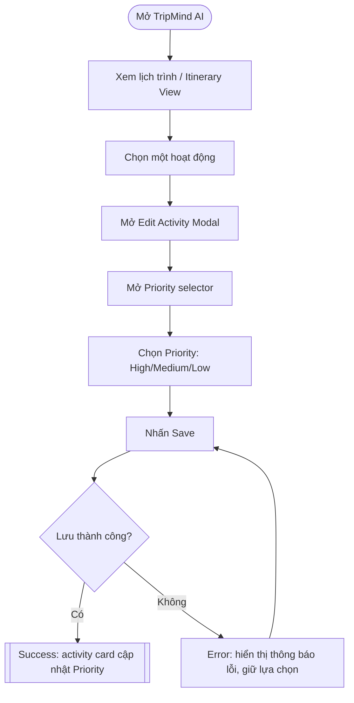
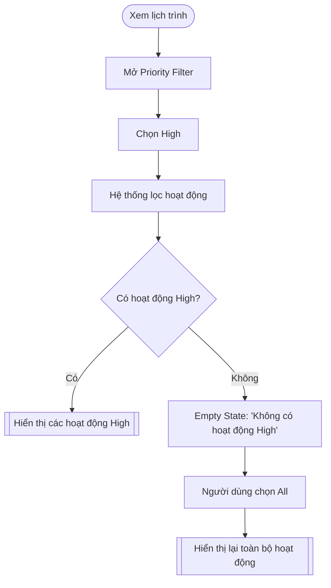
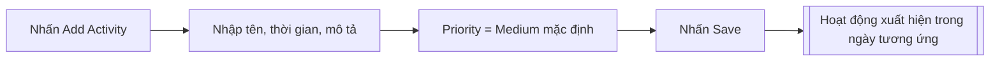

# PRD: 4.1 Luồng Người dùng (User Flow) — Activity Priority System

> **Dự án:** TripMind AI – Ứng dụng lập kế hoạch du lịch thông minh bằng AI
> **Môn học:** Chuyên đề 4: AI Product Development
> **Chương:** 4 – AI trong Thiết kế Sản phẩm · Mục 4.1
> **Tính năng:** Activity Priority System (Độ ưu tiên hoạt động trong lịch trình)
> **Phiên bản:** 2.0 · **Ngày cập nhật:** 15/09/2026

## Introduction

Thiết kế **User Flow** cho tính năng *Activity Priority System* của TripMind AI. Mỗi
lịch trình gồm nhiều hoạt động; tính năng này cho phép gán độ ưu tiên (High/Medium/Low)
cho từng hoạt động để người dùng biết đâu là điểm đến trọng tâm ("must-see"), đâu là
tùy chọn. Tài liệu định nghĩa các luồng chính, luồng thay thế (alternative), và đặt câu
hỏi review để phân biệt **evidence** với **assumption**.

Mục tiêu người dùng dẫn dắt thiết kế:
> "Tôi muốn nhanh chóng biết hoạt động nào quan trọng và tập trung vào những hoạt động
> có độ ưu tiên cao trong chuyến đi."

> ⚙️ **Ràng buộc:** Prototype thuần frontend, không backend/database, dữ liệu mock, có
> thể reset khi reload trang.

## Goals

- Định nghĩa luồng thay đổi Priority, lọc theo Priority, thêm hoạt động (mặc định Medium).
- Thể hiện rõ User Action / System Response / Decision / Success / Error ở mỗi bước.
- Đề xuất ≥ 2 phương án thao tác thay đổi Priority và phân tích so sánh.
- Phân biệt rõ đâu là bằng chứng, đâu là giả định cần con người xác nhận.

## User Stories

### US-001: Xác định luồng thay đổi Priority
**Description:** Là một người dùng, tôi muốn có luồng rõ ràng để đổi độ ưu tiên của một
hoạt động, để phản ánh đúng mức quan trọng.

**Acceptance Criteria:**
- [ ] Luồng: Xem lịch trình → chọn hoạt động → Edit → chọn Priority → Save → card cập nhật
- [ ] Sơ đồ Mermaid có nhánh Success và Error (Save thất bại)
- [ ] Mỗi bước ghi rõ User Action và System Response

### US-002: Xác định luồng lọc theo Priority
**Description:** Là một người dùng, tôi muốn luồng lọc hoạt động theo Priority, kể cả
khi không có kết quả.

**Acceptance Criteria:**
- [ ] Luồng có nhánh có kết quả và nhánh Empty State
- [ ] Có đường quay lại "All" từ Empty State
- [ ] Sơ đồ Mermaid thể hiện Decision "có hoạt động khớp?"

### US-003: Xác định luồng thêm hoạt động (mặc định Medium)
**Description:** Là một người dùng, tôi muốn thêm hoạt động mới với Priority mặc định
Medium, để không phải luôn chọn thủ công.

**Acceptance Criteria:**
- [ ] Luồng: Add Activity → nhập thông tin → Priority = Medium mặc định → Save
- [ ] Hoạt động mới xuất hiện đúng ngày trong lịch trình

### US-004: Đề xuất & so sánh Alternative Flow
**Description:** Là một designer, tôi muốn ≥ 2 cách thay đổi Priority được phân tích,
để chọn phương án phù hợp thay vì mặc định một cách.

**Acceptance Criteria:**
- [ ] Có Phương án A (Edit Modal) và Phương án B (inline trên card)
- [ ] Bảng so sánh theo ≥ 6 tiêu chí
- [ ] Kết luận ghi rõ đâu là AI đề xuất, đâu cần Human Decision

## Functional Requirements

- **FR-1:** Cung cấp sơ đồ Mermaid cho Flow 1 (đổi Priority) gồm Success + Error state.
- **FR-2:** Cung cấp sơ đồ Mermaid cho Flow 2 (lọc Priority) gồm Empty State + reset All.
- **FR-3:** Cung cấp sơ đồ Mermaid cho Flow 3 (thêm hoạt động, mặc định Medium).
- **FR-4:** Cung cấp bảng so sánh Phương án A vs B theo các tiêu chí UX.
- **FR-5:** Cung cấp phần User Flow Review (5 câu hỏi evidence/assumption).

## Non-Goals

- Không thiết kế chi tiết giao diện (thuộc 4.2 Wireframing).
- Không định nghĩa interaction states chi tiết (thuộc 4.3 Prototyping).
- Không bao gồm luồng gọi AI thật/đặt chỗ (ngoài phạm vi bài thực hành frontend).

## Technical Considerations

- Sơ đồ dùng **Mermaid** `flowchart` để GitHub render trực tiếp.
- Luồng chỉ mô phỏng thao tác frontend trên dữ liệu mock.
- Mã màn hình nhất quán để tham chiếu chéo với 4.2 và 4.3.

## Success Metrics

- Đổi Priority hoàn tất trong ≤ 3 thao tác (phương án được chọn).
- Người dùng nhận ra hoạt động High mà không cần hover/click.
- Không có nhánh flow "cụt" (mọi Empty/Error đều có lối ra).

## Open Questions

- Có nên cho đổi Priority inline ngay trên card (nhanh hơn) hay chỉ trong Modal (an toàn hơn)?
- Filter Priority nên áp cho toàn lịch trình hay theo từng ngày?

---

## Phụ lục A – Flow 1: Thay đổi Priority (có Success/Error)

| Bước | User Action | System Response | Decision / State |
|------|-------------|-----------------|------------------|
| 1 | Mở lịch trình | Hiển thị các ngày + hoạt động | – |
| 2 | Chọn hoạt động | Mở Edit Activity Modal | – |
| 3 | Mở Priority selector | Hiển thị 3 lựa chọn + mức hiện tại | – |
| 4 | Chọn Priority | Cập nhật lựa chọn trong modal | – |
| 5 | Nhấn Save | Lưu vào state frontend | Decision: thành công? |
| 6a | – | Card cập nhật, đóng modal | **Success State** |
| 6b | – | Thông báo lỗi, giữ nguyên dữ liệu | **Error State** |

## Phụ lục B – Flow 2: Lọc theo Priority (có Empty State)

## Phụ lục C – Flow 3: Thêm hoạt động (mặc định Medium)

## Phụ lục D – Alternative Flow: 2 cách thay đổi Priority

**Phương án A — Đổi trong Edit Activity Modal**
Click hoạt động → Edit → Priority selector → chọn → Save.

**Phương án B — Đổi trực tiếp (inline) trên activity card**
Click badge Priority trên card → menu nhỏ hiện ra → chọn mức mới → tự lưu.

### Bảng so sánh

| Tiêu chí | Phương án A (Modal) | Phương án B (Inline) |
|----------|---------------------|----------------------|
| Số bước thao tác | Nhiều hơn (~5 bước) | Ít hơn (~2 bước) |
| Khả năng nhận biết | Rõ, gom trong 1 chỗ sửa | Nhanh nhưng dễ bị bỏ sót |
| Cognitive load | Thấp (ngữ cảnh rõ ràng) | Thấp nếu quen, cao nếu lần đầu |
| Khả năng gây nhầm lẫn | Thấp (có nút Save rõ) | Cao hơn (đổi ngay, dễ chạm nhầm) |
| Accessibility | Dễ (form chuẩn, focus rõ) | Khó hơn (menu nổi, cần xử lý focus) |
| Responsive | Ổn trên mobile (modal full) | Menu nhỏ khó chạm trên mobile |
| Nhất quán với TripMind AI | Cao (dùng lại modal edit) | Cần thêm pattern mới |

### Kết luận

- **AI đề xuất:** Ưu tiên **Phương án A** làm cách chính (an toàn, nhất quán, dễ
  accessibility), cân nhắc **Phương án B** như lối tắt bổ sung ở bản sau.
- **Human Decision:** Việc chọn A, B, hay cả hai cần con người quyết định dựa trên
  hành vi người dùng thực tế. → *Needs human validation.*

## Phụ lục E – User Flow Review

1. **Bằng chứng hỗ trợ lựa chọn?** Hiện dựa trên heuristic UX (số bước ít, tính nhất
   quán), **chưa có dữ liệu người dùng thật**.
2. **Assumption đang có?** (a) Người dùng đổi Priority không thường xuyên nên Modal
   chấp nhận được; (b) người dùng hiểu ý nghĩa 3 mức Priority.
3. **Assumption rủi ro cao nhất?** Giả định (a) — nếu người dùng đổi Priority rất
   thường xuyên, Modal sẽ gây phiền, Phương án B lại tốt hơn.
4. **Cần con người quyết định?** Chọn A/B/cả hai; đặt filter theo toàn lịch trình hay theo ngày.
5. **Validate thế nào?** Usability test 5 người: đo số lần đổi Priority, thời gian, lỗi
   thao tác (xem 4.4 Validation Plan).

> **Chưa có bằng chứng thực tế cho phần lớn giả định – cần human validation.** Không
> bịa user research hay dữ liệu giả.
