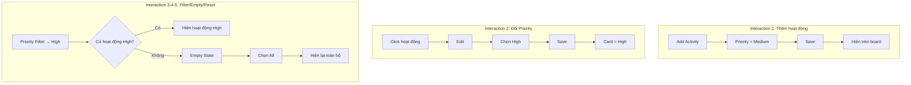

# PRD: 4.3 Tạo Bản mẫu (Prototyping) — Activity Priority System

> **Dự án:** TripMind AI – Ứng dụng lập kế hoạch du lịch thông minh bằng AI
> **Môn học:** Chuyên đề 4: AI Product Development
> **Chương:** 4 – AI trong Thiết kế Sản phẩm · Mục 4.3 + Bài thực hành 4
> **Tính năng:** Activity Priority System
> **Phiên bản:** 2.0 · **Ngày cập nhật:** 15/09/2026

## Introduction

Xây dựng **prototype** cho *Activity Priority System* để kiểm tra behavior càng sớm
càng tốt. Prototype phải mô phỏng **user journey và cả failure/empty paths**, không chỉ
là màn hình tĩnh. Tài liệu này cũng đóng vai trò **Bài thực hành 4 – Demo minh hoạ**.

> ⚙️ **Ràng buộc:** Prototype thuần frontend, dữ liệu mock, không backend/database.
> "AI sinh lịch trình" được giả lập bằng dữ liệu mẫu; reset khi reload trang.

## Goals

- Mô phỏng 5 interaction: thêm hoạt động, đổi Priority, filter, empty state, reset.
- Xử lý các failure/recovery path có ý nghĩa với UX.
- Cung cấp kịch bản demo input/output cụ thể cho Bài thực hành 4.
- Định nghĩa đầy đủ các trạng thái tương tác của giao diện.

## User Stories

### US-001: Prototype thêm hoạt động (mặc định Medium)
**Description:** Là một người dùng, tôi muốn thêm hoạt động và nó tự nhận Priority
Medium, để không phải chọn thủ công mỗi lần.

**Acceptance Criteria:**
- [ ] Add Activity → nhập thông tin → Priority = Medium mặc định
- [ ] Save → hoạt động xuất hiện đúng ngày trên lịch trình
- [ ] Badge Priority Medium hiển thị ngay trên card mới

### US-002: Prototype thay đổi Priority
**Description:** Là một người dùng, tôi muốn đổi Priority và thấy card cập nhật ngay.

**Acceptance Criteria:**
- [ ] Click hoạt động → Edit → chọn High → Save
- [ ] Activity card cập nhật badge thành High
- [ ] Có phản hồi thành công (toast/state)

### US-003: Prototype filter + empty + reset
**Description:** Là một người dùng, tôi muốn lọc theo Priority, hiểu khi rỗng, và quay lại.

**Acceptance Criteria:**
- [ ] Filter High → chỉ hiện hoạt động High
- [ ] Không có kết quả → Empty State rõ ràng
- [ ] Chọn All → hiện lại toàn bộ hoạt động

### US-004: Demo minh hoạ (Bài thực hành 4)
**Description:** Là người trình bày, tôi muốn kịch bản demo input/output để trình diễn.

**Acceptance Criteria:**
- [ ] Có dữ liệu mock đầu vào (JSON) và trạng thái đầu ra tương ứng
- [ ] Có checklist nghiệm thu demo
- [ ] Demo bao phủ cả happy path lẫn empty/error path

## Functional Requirements

- **FR-1:** Mô phỏng 5 interaction chính bằng sơ đồ/bảng bước.
- **FR-2:** Định nghĩa 8 interaction states: default, hover, focus, selected, disabled, empty, error, success.
- **FR-3:** Liệt kê failure/recovery path và cách xử lý (hoặc lý do bỏ qua).
- **FR-4:** Cung cấp dữ liệu mock đầu vào + kết quả đầu ra cho demo.
- **FR-5:** Cung cấp checklist nghiệm thu demo.

## Non-Goals

- Không lập trình prototype tương tác thật (chỉ đặc tả behavior).
- Không thêm chức năng backend (save server, đồng bộ, xác thực…).
- Không đo lường người dùng thật ở bước này (thuộc Validation Plan 4.4).

## Technical Considerations

- Prototype **mid-fidelity**: có điều hướng + trạng thái, chưa hoàn thiện đồ họa.
- State quản lý ở frontend (mock), reset khi reload — đúng ràng buộc bài.
- Nhất quán với User Flow (4.1) và Wireframe (4.2).

## Success Metrics

- Cả 5 interaction chạy thông suốt trong mô phỏng, không có bước cụt.
- Mọi failure/empty path đều có lối phục hồi rõ ràng.
- Người xem demo hiểu tính năng chỉ qua kịch bản input/output.

## Open Questions

- Khi Save thất bại (mock), nên giữ modal mở hay đóng và cho Undo?
- Có nên chặn double-click Save bằng disable nút trong lúc xử lý không?

---

## Phụ lục A – 5 Interaction (sơ đồ tổng)



## Phụ lục B – Bảng bước chi tiết từng interaction

| # | Interaction | Bước | Kết quả mong đợi |
|---|-------------|------|------------------|
| 1 | Thêm hoạt động | Add → nhập → Save | Card mới, badge Medium |
| 2 | Đổi Priority | Click → Edit → High → Save | Card đổi badge sang High + toast success |
| 3 | Filter | Chọn High | Chỉ còn hoạt động High |
| 4 | Empty State | Filter High khi không có | Hiện Empty State + nút "All" |
| 5 | Reset | Chọn All | Hiện lại toàn bộ hoạt động |

## Phụ lục C – Interaction States (8 trạng thái)

| Trạng thái | Áp dụng ở | Mô tả |
|------------|-----------|-------|
| Default | Card, filter, selector | Trạng thái nghỉ |
| Hover | Filter chip, nút | Viền/nền đổi nhẹ khi rê chuột |
| Focus | Selector, filter, nút | Viền focus rõ (điều hướng bàn phím) |
| Selected | Filter chip, priority option | Mức đang chọn nổi bật (nền đậm + ✓) |
| Disabled | Nút Save (khi đang xử lý) | Mờ, chặn double-click |
| Empty | Danh sách sau filter | Empty State có action quay lại |
| Error | Sau Save thất bại | Thông báo lỗi, giữ dữ liệu, cho thử lại |
| Success | Sau Save thành công | Toast xác nhận, card cập nhật |

## Phụ lục D – Failure / Recovery Path

| Tình huống | Có cần cho prototype? | Xử lý / Lý do |
|------------|-----------------------|---------------|
| Save thất bại | Có | Hiện lỗi, giữ lựa chọn trong modal, cho Save lại |
| Dữ liệu không hợp lệ (tên rỗng) | Có | Chặn Save, highlight trường lỗi |
| Không có hoạt động khớp filter | Có | Empty State + nút quay lại All |
| Click Save nhiều lần | Có | Disable nút Save trong lúc xử lý (chống trùng) |
| Đóng modal khi chưa hoàn thành | Có | Hỏi xác nhận "Bỏ thay đổi?" trước khi đóng |
| Mất kết nối server | **Không** | Prototype thuần frontend, không có server → không áp dụng |
| Lỗi xác thực đăng nhập | **Không** | Ngoài phạm vi tính năng Priority (không có backend) |

## Phụ lục E – Bài thực hành 4: Demo minh hoạ

**Dữ liệu mock đầu vào (một ngày trong lịch trình):**

```json
{
  "day": 1,
  "activities": [
    { "name": "Hồ Xuân Hương", "time": "08:00", "cost": 0, "priority": "high" },
    { "name": "Ăn trưa đặc sản", "time": "12:00", "cost": 150000, "priority": "medium" },
    { "name": "Ghé shop lưu niệm", "time": "16:00", "cost": 100000, "priority": "low" }
  ]
}
```

**Kịch bản demo & đầu ra:**

```
1) Filter = All      → hiển thị 3 hoạt động (High, Medium, Low)
2) Filter = High     → chỉ hiển thị "Hồ Xuân Hương" (▲ High)
3) Filter = Low      → chỉ hiển thị "Ghé shop lưu niệm" (▽ Low)
4) Đổi "Ăn trưa" Medium → High, Save → card "Ăn trưa" hiện ▲ High
5) Filter = High     → giờ hiển thị 2 hoạt động (Hồ Xuân Hương + Ăn trưa)
6) Filter = Low ... đổi "Ghé shop" thành Medium → Filter Low = Empty State
7) Chọn All          → hiển thị lại toàn bộ
```

**Checklist nghiệm thu demo:**

- [x] Thêm hoạt động mới nhận Priority Medium mặc định
- [x] Đổi Priority cập nhật card + có phản hồi success
- [x] Filter High/Medium/Low lọc đúng
- [x] Empty State hiển thị khi filter không có kết quả
- [x] Nút "All" khôi phục toàn bộ hoạt động
- [x] Priority phân biệt bằng text + icon (không chỉ màu)
- [x] Failure path (Save lỗi, tên rỗng, double-click) được xử lý
