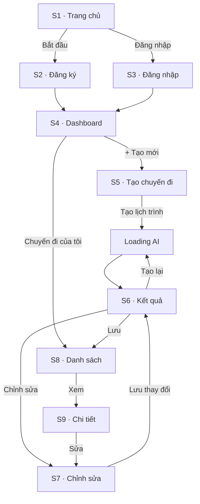

# PRD: Tạo Bản mẫu (Prototyping) & Demo

> **Dự án:** TripMind AI – Ứng dụng lập kế hoạch du lịch thông minh bằng AI
> **Môn học:** Chuyên đề 4: AI Product Development
> **Chương:** 4 – AI trong Thiết kế Sản phẩm · Mục 4.3 + Bài thực hành 4
> **Phiên bản:** 1.0 · **Ngày cập nhật:** 15/09/2026

## Introduction

Xây dựng **bản mẫu (prototype)** cho TripMind AI bằng cách liên kết các màn hình
(từ wireframe 4.2) theo đúng User Flow (4.1), mô phỏng cách người dùng tương tác thật.
Tài liệu này cũng bao gồm **Bài thực hành 4 – Demo một số ví dụ minh hoạ**, thể hiện
đầu vào/đầu ra thực tế của sản phẩm.

## Goals

- Định nghĩa các liên kết bấm-được giữa các màn hình (prototype link map).
- Mô tả các kịch bản demo end-to-end theo luồng chính.
- Định nghĩa đầy đủ các trạng thái tương tác (loading, empty, error, success).
- Cung cấp ví dụ demo với input/output cụ thể cho Bài thực hành 4.

## User Stories

### US-001: Định nghĩa liên kết điều hướng giữa các màn hình
**Description:** Là một người dùng, tôi muốn bấm các nút và được chuyển đến đúng màn
hình tiếp theo, để trải nghiệm liền mạch.

**Acceptance Criteria:**
- [ ] Mỗi nút chính có đích đến rõ ràng (ví dụ "Bắt đầu" → Đăng ký)
- [ ] Sơ đồ prototype link map vẽ bằng Mermaid
- [ ] Bao phủ đầy đủ luồng: Trang chủ → Đăng ký → Tạo → Kết quả → Lưu → Danh sách
- [ ] Có liên kết quay lại (back) hợp lý giữa các màn hình

### US-002: Mô phỏng kịch bản tạo lịch trình end-to-end
**Description:** Là một người dùng mới, tôi muốn đi trọn kịch bản tạo lịch trình Đà Lạt
để kiểm tra luồng hoạt động.

**Acceptance Criteria:**
- [ ] Kịch bản gồm các bước từ trang chủ đến khi lưu thành công
- [ ] Mỗi bước ghi rõ: màn hình, tương tác, kết quả mong đợi
- [ ] Kết quả cuối: chuyến đi xuất hiện trong danh sách

### US-003: Thể hiện các trạng thái tương tác của giao diện
**Description:** Là một người dùng, tôi muốn giao diện phản hồi rõ ràng ở mọi trạng
thái, để biết hệ thống đang làm gì.

**Acceptance Criteria:**
- [ ] Có mô tả trạng thái Loading khi AI xử lý (có progress/thông điệp)
- [ ] Có trạng thái Empty khi chưa có chuyến đi nào
- [ ] Có trạng thái Error khi AI lỗi + nút "Thử lại"
- [ ] Có trạng thái Success (toast) khi lưu thành công

### US-004: Demo ví dụ minh hoạ (Bài thực hành 4)
**Description:** Là người trình bày, tôi muốn có ví dụ input/output cụ thể để demo sản phẩm.

**Acceptance Criteria:**
- [ ] Có ví dụ đầu vào (JSON) rõ ràng
- [ ] Có ví dụ đầu ra (lịch trình theo ngày + chi phí)
- [ ] Có checklist nghiệm thu demo
- [ ] Demo minh hoạ đúng luồng chính của sản phẩm

## Functional Requirements

- **FR-1:** Cung cấp prototype link map (Mermaid) thể hiện điều hướng giữa 9 màn hình.
- **FR-2:** Mô tả ít nhất 2 kịch bản demo end-to-end dạng bảng bước.
- **FR-3:** Định nghĩa 6 trạng thái tương tác: default, loading, empty, error, success, disabled.
- **FR-4:** Cung cấp ví dụ input/output cụ thể cho Bài thực hành 4.
- **FR-5:** Cung cấp checklist nghiệm thu demo.

## Non-Goals

- Không lập trình prototype tương tác thật (chỉ mô tả thiết kế bản mẫu).
- Không thiết kế lại bố cục màn hình (đã có ở 4.2).
- Không bao gồm A/B testing hay đo lường người dùng thật.

## Technical Considerations

- Prototype thuộc mức **mid-fidelity**: có điều hướng + trạng thái, chưa hoàn thiện đồ họa.
- Công cụ đề xuất khi triển khai thực: Figma (thiết kế) hoặc HTML tĩnh (demo nhanh).
- Link map và kịch bản phải nhất quán với Screen Map ở 4.1.

## Success Metrics

- Luồng chính (đăng ký → tạo → lưu) chạy thông suốt, không có bước cụt.
- Người xem demo hiểu được cách sản phẩm hoạt động chỉ qua kịch bản.
- Đủ 6 trạng thái tương tác được thể hiện.

## Open Questions

- Nên dùng Figma hay HTML tĩnh cho bản demo thực tế trước lớp?
- Có nên demo thêm kịch bản lỗi AI để thể hiện khả năng phục hồi không?

---

## Phụ lục A – Prototype Link Map



## Phụ lục B – Kịch bản demo: "Tạo lịch trình Đà Lạt 3 ngày"

| Bước | Màn hình | Tương tác | Kết quả mong đợi |
|------|----------|-----------|------------------|
| 1 | S1 Trang chủ | Bấm "Bắt đầu ngay" | Chuyển sang S2 Đăng ký |
| 2 | S2 Đăng ký | Nhập email + mật khẩu | Vào S4 Dashboard |
| 3 | S4 Dashboard | Bấm "+ Tạo mới" | Vào S5 Tạo chuyến đi |
| 4 | S5 Tạo chuyến đi | Nhập "Đà Lạt", 3 ngày, 3tr, sở thích | Nút "Tạo lịch trình" sáng |
| 5 | S5 → Loading | Bấm "Tạo lịch trình" | Hiện loading AI |
| 6 | S6 Kết quả | Chờ ~10s | Lịch trình 3 ngày + chi phí 2.75tr |
| 7 | S6 Kết quả | Bấm "Lưu chuyến đi" | Toast thành công, sang S8 |
| 8 | S8 Danh sách | Xem card | Chuyến "Đà Lạt" trong danh sách |

## Phụ lục C – Trạng thái tương tác

| Trạng thái | Mô tả | Màn hình |
|------------|-------|----------|
| Default | Trạng thái ban đầu | Mọi màn hình |
| Loading | Đang chờ AI (progress + thông điệp) | S5 → S6 |
| Empty | Chưa có chuyến đi | S8 |
| Error | AI lỗi/timeout + "Thử lại" | S6 |
| Success | Toast thành công | S6, S7 |
| Disabled | Nút mờ khi thiếu dữ liệu | S5 |

### Minh họa trạng thái Loading

```
┌────────────────────────────────────────────────┐
│              🤖  AI đang lên kế hoạch...          │
│              ⏳  [▓▓▓▓▓▓░░░░]  60%                │
│     "Đang tối ưu lịch trình theo ngân sách"      │
└────────────────────────────────────────────────┘
```

## Phụ lục D – Bài thực hành 4: Demo minh hoạ

**Đầu vào demo:**

```json
{
  "destination": "Đà Lạt",
  "days": 3,
  "budget": 3000000,
  "preferences": ["thiên nhiên", "ẩm thực", "check-in"]
}
```

**Đầu ra demo:**

```
Đà Lạt · 3 ngày · Ước tính 2.750.000đ (trong ngân sách ✅)

NGÀY 1:
  08:00  Hồ Xuân Hương              0đ
  10:00  Quảng trường Lâm Viên      0đ
  12:00  Ăn trưa đặc sản            150.000đ
  15:00  Đồi chè Cầu Đất            50.000đ
  19:00  Chợ đêm Đà Lạt            200.000đ

NGÀY 2: Thung lũng Tình Yêu, Làng Cù Lần, ...
NGÀY 3: Ga Đà Lạt, Cafe view, mua đặc sản, ...
```

**Checklist nghiệm thu demo:**

- [x] Luồng đăng ký → tạo lịch trình → lưu chạy thông suốt
- [x] AI trả về lịch trình đúng định dạng theo ngày
- [x] Chi phí ước tính hiển thị và so sánh ngân sách
- [x] Các trạng thái loading/error/empty được thể hiện
- [x] Điều hướng đúng theo prototype link map
