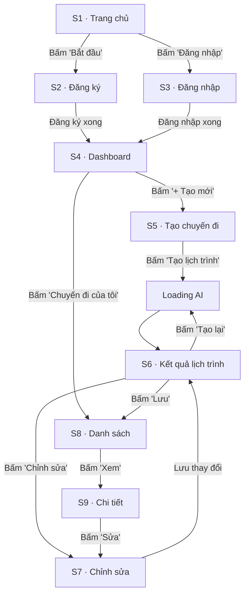

# 4.3 Tạo Bản mẫu (Prototyping)

> **Dự án:** TripMind AI – Ứng dụng lập kế hoạch du lịch thông minh bằng AI
> **Môn học:** Chuyên đề 4: AI Product Development
> **Chương:** 4 – AI trong Thiết kế Sản phẩm
> **Phiên bản tài liệu:** 1.0
> **Ngày cập nhật:** 15/09/2026

---

## 1. Mục đích

Tài liệu này mô tả **bản mẫu (prototype)** của TripMind AI — mô phỏng cách người
dùng tương tác thật với sản phẩm bằng cách liên kết các màn hình (từ wireframe 4.2)
theo đúng User Flow (4.1). Prototype giúp kiểm tra trải nghiệm trước khi lập trình,
phát hiện sớm vấn đề về luồng và bố cục.

---

## 2. Loại prototype & mức độ chi tiết

| Tiêu chí | Lựa chọn cho TripMind AI |
|----------|--------------------------|
| **Độ trung thực (Fidelity)** | Mid-fidelity (có bố cục rõ, chưa hoàn thiện đồ họa) |
| **Mức tương tác** | Có điều hướng giữa các màn hình + trạng thái loading |
| **Công cụ đề xuất** | Figma (thiết kế) / prototype HTML tĩnh (demo nhanh) |
| **Phạm vi** | Luồng chính: Đăng ký → Tạo lịch trình → Xem → Lưu |

---

## 3. Bản đồ liên kết prototype (Prototype Link Map)

Sơ đồ dưới mô tả **các liên kết bấm được** giữa các màn hình khi chạy prototype:



---

## 4. Kịch bản demo (Demo Scenarios)

### Kịch bản 1: "Người dùng mới tạo lịch trình Đà Lạt 3 ngày"

| Bước | Màn hình | Tương tác | Kết quả mong đợi |
|------|----------|-----------|------------------|
| 1 | S1 Trang chủ | Bấm "Bắt đầu ngay" | Chuyển sang S2 Đăng ký |
| 2 | S2 Đăng ký | Nhập email + mật khẩu, bấm "Đăng ký" | Vào S4 Dashboard |
| 3 | S4 Dashboard | Bấm "+ Tạo mới" | Vào S5 Tạo chuyến đi |
| 4 | S5 Tạo chuyến đi | Nhập "Đà Lạt", 3 ngày, 3.000.000đ, chọn sở thích | Nút "Tạo lịch trình" sáng lên |
| 5 | S5 → Loading | Bấm "Tạo lịch trình" | Hiện màn hình loading AI |
| 6 | S6 Kết quả | Chờ ~10s | Hiển thị lịch trình 3 ngày + chi phí 2.75tr |
| 7 | S6 Kết quả | Bấm "Lưu chuyến đi" | Thông báo thành công, chuyển S8 |
| 8 | S8 Danh sách | Xem card "Đà Lạt" | Chuyến đi xuất hiện trong danh sách |

### Kịch bản 2: "Chỉnh sửa và xuất PDF"

| Bước | Màn hình | Tương tác | Kết quả mong đợi |
|------|----------|-----------|------------------|
| 1 | S8 Danh sách | Bấm "Xem" chuyến Đà Lạt | Vào S9 Chi tiết |
| 2 | S9 Chi tiết | Bấm "Sửa" | Vào S7 Chỉnh sửa |
| 3 | S7 Chỉnh sửa | Xóa 1 hoạt động, lưu | Chi phí cập nhật lại |
| 4 | S9 Chi tiết | Bấm "Xuất PDF" | Tải file PDF lịch trình |

---

## 5. Trạng thái tương tác (Interaction States)

Prototype cần thể hiện các trạng thái khác nhau của giao diện:

| Trạng thái | Mô tả | Màn hình áp dụng |
|------------|-------|------------------|
| **Default** | Trạng thái ban đầu | Mọi màn hình |
| **Loading** | Đang chờ AI xử lý (spinner + thông báo) | S5 → S6 |
| **Empty** | Chưa có chuyến đi nào | S8 |
| **Error** | AI lỗi/timeout, hiện thông báo + "Thử lại" | S6 |
| **Success** | Lưu/thao tác thành công (toast) | S6, S7 |
| **Disabled** | Nút "Tạo lịch trình" mờ khi thiếu dữ liệu | S5 |

### Minh họa trạng thái Loading (S5 → S6)

```
┌────────────────────────────────────────────────┐
│                                                  │
│              🤖  AI đang lên kế hoạch...          │
│              ⏳  [▓▓▓▓▓▓░░░░]  60%                │
│                                                  │
│     "Đang tối ưu lịch trình theo ngân sách"      │
│                                                  │
└────────────────────────────────────────────────┘
```

### Minh họa trạng thái Empty (S8)

```
┌────────────────────────────────────────────────┐
│  Chuyến đi của tôi                               │
│                                                  │
│              ▢  (hình minh họa)                   │
│      Bạn chưa có chuyến đi nào                    │
│      Hãy tạo chuyến đi đầu tiên của bạn!          │
│                                                  │
│              [  + Tạo chuyến đi  ]               │
└────────────────────────────────────────────────┘
```

---

## 6. Bài thực hành 4 – Demo minh hoạ

> Phần này minh hoạ trực tiếp cho **Bài thực hành 4: Demo một số ví dụ minh hoạ**.

### 6.1. Ví dụ đầu vào & đầu ra của demo

**Đầu vào demo:**

```json
{
  "destination": "Đà Lạt",
  "days": 3,
  "budget": 3000000,
  "preferences": ["thiên nhiên", "ẩm thực", "check-in"]
}
```

**Đầu ra demo (lịch trình AI sinh ra):**

```
Đà Lạt · 3 ngày · Ước tính 2.750.000đ (trong ngân sách ✅)

NGÀY 1:
  08:00  Hồ Xuân Hương              0đ
  10:00  Quảng trường Lâm Viên      0đ
  12:00  Ăn trưa đặc sản            150.000đ
  15:00  Đồi chè Cầu Đất            50.000đ
  19:00  Chợ đêm Đà Lạt            200.000đ

NGÀY 2:
  08:00  Thung lũng Tình Yêu        100.000đ
  ...

NGÀY 3:
  ...
```

### 6.2. Checklist nghiệm thu demo

- [x] Luồng đăng ký → tạo lịch trình → lưu chạy thông suốt
- [x] AI trả về lịch trình đúng định dạng theo ngày
- [x] Chi phí ước tính hiển thị và so sánh ngân sách
- [x] Các trạng thái loading/error/empty được thể hiện
- [x] Điều hướng giữa các màn hình đúng theo prototype link map

---

## 7. Kết luận

Prototype của TripMind AI đã liên kết đầy đủ các màn hình theo User Flow, mô phỏng
được các kịch bản sử dụng thực tế và các trạng thái tương tác quan trọng (loading,
empty, error, success). Bài demo minh hoạ chứng minh luồng chính hoạt động mạch lạc,
sẵn sàng cho bước đánh giá thiết kế bằng AI ở mục 4.4.
