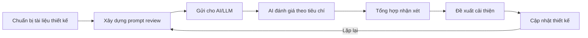

# PRD: AI Đánh giá Thiết kế (AI Design Review)

> **Dự án:** TripMind AI – Ứng dụng lập kế hoạch du lịch thông minh bằng AI
> **Môn học:** Chuyên đề 4: AI Product Development
> **Chương:** 4 – AI trong Thiết kế Sản phẩm · Mục 4.4
> **Phiên bản:** 1.0 · **Ngày cập nhật:** 15/09/2026

## Introduction

Áp dụng **AI để đánh giá thiết kế (AI Design Review)** — dùng mô hình AI (LLM) như một
"chuyên gia UX/UI" để rà soát User Flow (4.1), Wireframe (4.2) và Prototype (4.3) của
TripMind AI, từ đó chỉ ra điểm mạnh, điểm yếu và đề xuất cải thiện cụ thể. Đây là ứng
dụng thực tế của AI trong quy trình phát triển sản phẩm — đúng trọng tâm môn học.

## Goals

- Thiết lập bộ tiêu chí đánh giá thiết kế chuẩn (7 tiêu chí).
- Sử dụng AI để chấm điểm và nhận xét thiết kế theo từng tiêu chí.
- Tổng hợp điểm yếu và đề xuất cải thiện có thể hành động được.
- So sánh thiết kế trước/sau khi áp dụng đề xuất từ AI.

## User Stories

### US-001: Thiết lập bộ tiêu chí đánh giá thiết kế
**Description:** Là một product owner, tôi cần bộ tiêu chí rõ ràng để AI đánh giá thiết
kế một cách nhất quán.

**Acceptance Criteria:**
- [ ] Có tối thiểu 7 tiêu chí (usability, consistency, hierarchy, flow, feedback, accessibility, phù hợp mục tiêu)
- [ ] Mỗi tiêu chí có câu hỏi đánh giá cụ thể
- [ ] Tiêu chí áp dụng được cho cả 3 tài liệu 4.1–4.3

### US-002: Xây dựng prompt để AI review thiết kế
**Description:** Là một developer, tôi cần prompt chuẩn để AI đóng vai chuyên gia UX/UI
và đánh giá khách quan.

**Acceptance Criteria:**
- [ ] Có system prompt định hình vai trò AI (chuyên gia UX/UI)
- [ ] Có user prompt cung cấp ngữ cảnh thiết kế và yêu cầu chấm điểm /10
- [ ] Prompt yêu cầu nêu cả điểm mạnh, điểm yếu và đề xuất

### US-003: Thu thập và tổng hợp kết quả AI đánh giá
**Description:** Là một product owner, tôi muốn có bảng điểm và nhận xét của AI để nắm
được chất lượng thiết kế.

**Acceptance Criteria:**
- [ ] Bảng điểm theo từng tiêu chí + điểm trung bình
- [ ] Danh sách điểm mạnh AI ghi nhận
- [ ] Danh sách điểm yếu/vấn đề kèm mức độ và màn hình liên quan

### US-004: Chuyển kết quả AI thành đề xuất cải thiện
**Description:** Là một designer, tôi muốn biết cần sửa gì và ưu tiên ra sao sau khi AI review.

**Acceptance Criteria:**
- [ ] Mỗi đề xuất gắn với một vấn đề gốc (traceable)
- [ ] Mỗi đề xuất có mức ưu tiên (cao/trung bình/thấp)
- [ ] Có bảng so sánh trước/sau khi áp dụng đề xuất

## Functional Requirements

- **FR-1:** Định nghĩa bộ 7 tiêu chí đánh giá thiết kế kèm câu hỏi.
- **FR-2:** Cung cấp system prompt + user prompt dùng cho AI review.
- **FR-3:** Cung cấp bảng điểm chi tiết theo tiêu chí + điểm trung bình.
- **FR-4:** Liệt kê điểm mạnh và điểm yếu (có mã định danh I1–I5).
- **FR-5:** Cung cấp bảng đề xuất cải thiện (R1–R5) truy vết tới điểm yếu.
- **FR-6:** Cung cấp bảng so sánh thiết kế trước/sau review.

## Non-Goals

- Không thay thế kiểm thử người dùng thật (user testing).
- Không tự động áp dụng đề xuất — cần con người xác nhận.
- Không đánh giá mã nguồn (chỉ đánh giá thiết kế UX/UI).

## Technical Considerations

- Có thể dùng OpenAI GPT-4 hoặc Anthropic Claude làm "reviewer".
- Prompt cần cung cấp đủ ngữ cảnh (mô tả flow, wireframe, prototype) để AI đánh giá đúng.
- Kết quả AI mang tính tham khảo; cần kiểm chứng lại bởi con người.
- Nên lặp lại review sau mỗi vòng cải thiện thiết kế (iterative).

## Success Metrics

- Điểm trung bình thiết kế đạt ≥ 8/10 sau khi áp dụng đề xuất.
- 100% điểm yếu được phát hiện đều có đề xuất cải thiện tương ứng.
- Mỗi đề xuất đều truy vết được về vấn đề gốc.

## Open Questions

- Có nên chạy AI review định kỳ ở mỗi vòng lặp thiết kế không?
- Có nên kết hợp nhiều mô hình AI để giảm thiên kiến của một mô hình không?

---

## Phụ lục A – Quy trình AI Design Review



## Phụ lục B – Bộ tiêu chí đánh giá

| # | Tiêu chí | Câu hỏi đánh giá |
|---|----------|------------------|
| 1 | Usability | Người dùng có dễ hoàn thành mục tiêu không? |
| 2 | Consistency | Bố cục, nút, thuật ngữ có đồng nhất không? |
| 3 | Hierarchy | Thông tin quan trọng có nổi bật không? |
| 4 | Flow | Số bước có tối ưu, có bị lạc đường không? |
| 5 | Feedback | Loading, lỗi, thành công có rõ ràng không? |
| 6 | Accessibility | Tương phản, kích thước, mobile có ổn không? |
| 7 | Phù hợp mục tiêu | Thiết kế có phục vụ đúng giá trị cốt lõi không? |

## Phụ lục C – Prompt sử dụng

**System prompt:**

```
Bạn là một chuyên gia thiết kế UX/UI với 10 năm kinh nghiệm đánh giá sản phẩm số.
Hãy đánh giá thiết kế được cung cấp một cách khách quan, chỉ ra cả điểm mạnh lẫn
điểm yếu, đưa ra đề xuất cải thiện cụ thể và chấm điểm /10 cho từng tiêu chí.
```

**User prompt:**

```
Hãy đánh giá thiết kế ứng dụng web "TripMind AI - lập kế hoạch du lịch bằng AI" dựa trên:
- User Flow: [mô tả luồng 6 màn hình...]
- Wireframe: [mô tả bố cục các màn hình...]
- Prototype: [mô tả liên kết + trạng thái...]
Đánh giá theo 7 tiêu chí, mỗi tiêu chí: điểm /10 + nhận xét + đề xuất cải thiện.
```

## Phụ lục D – Kết quả AI đánh giá

### Bảng điểm

| Tiêu chí | Điểm | Nhận xét của AI |
|----------|------|-----------------|
| Usability | 8.5/10 | Luồng tạo lịch trình ngắn gọn, form 4 trường là điểm mạnh |
| Consistency | 8.0/10 | Header/card nhất quán; cần thống nhất vị trí nút chính |
| Hierarchy | 7.5/10 | Chi phí và nút "Lưu" nổi bật tốt; danh sách hoạt động hơi đều |
| Flow | 9.0/10 | Số bước tối ưu, có xử lý lỗi AI và nút "Tạo lại" hợp lý |
| Feedback | 8.0/10 | Có loading/error/success; nên thêm progress cụ thể |
| Accessibility | 7.0/10 | Cần kiểm tra tương phản màu và kích thước chạm mobile |
| Phù hợp mục tiêu | 9.0/10 | Bám sát giá trị "tạo lịch trình trong 5 phút" |
| **Trung bình** | **8.1/10** | Thiết kế tốt ở mức MVP, còn dư địa tinh chỉnh |

### Điểm mạnh AI ghi nhận

1. Luồng người dùng ngắn và rõ ràng (~5 bước).
2. Form đầu vào tối giản, giảm rào cản.
3. Xử lý trạng thái tốt (loading, empty, error, success).
4. Tập trung vào chức năng lõi (AI), không phân tán.

### Điểm yếu AI phát hiện

| Mã | Vấn đề | Mức độ | Màn hình |
|----|--------|--------|----------|
| I1 | Chờ AI lâu, chỉ có spinner đơn giản dễ gây sốt ruột | Cao | S5→S6 |
| I2 | Chưa so sánh nhiều phương án lịch trình cạnh nhau | Trung bình | S6 |
| I3 | Danh sách hoạt động thiếu phân biệt trực quan | Trung bình | S6, S9 |
| I4 | Chưa rõ cách chỉnh sửa nhanh 1 hoạt động | Trung bình | S7 |
| I5 | Cần kiểm tra accessibility (màu, kích thước) trên mobile | Thấp | Tất cả |

## Phụ lục E – Đề xuất cải thiện

| Mã | Vấn đề gốc | Đề xuất | Ưu tiên |
|----|-----------|---------|---------|
| R1 | I1 | Progress bar có thông điệp tiến trình ("Đang chọn địa điểm...") | Cao |
| R2 | I3 | Thêm icon/màu phân loại hoạt động (🍜 ăn, 📸 tham quan, 🚗 di chuyển) | Cao |
| R3 | I2 | Cho AI tạo 2–3 phương án, hiển thị dạng tab để so sánh | Trung bình |
| R4 | I4 | Chỉnh sửa inline (bấm trực tiếp vào hoạt động) | Trung bình |
| R5 | I5 | Áp chuẩn WCAG AA; nút chạm tối thiểu 44x44px | Trung bình |

## Phụ lục F – So sánh trước/sau review

| Khía cạnh | Trước | Sau khi áp dụng đề xuất |
|-----------|-------|-------------------------|
| Màn hình loading | Chỉ spinner | Progress bar + thông điệp |
| Danh sách hoạt động | Text thuần | Có icon/màu phân loại |
| Phương án lịch trình | 1 phương án | Tạo & so sánh nhiều phương án |
| Chỉnh sửa | Màn hình riêng | Chỉnh sửa inline nhanh |
| Accessibility | Chưa kiểm chuẩn | Đạt WCAG AA cơ bản |
