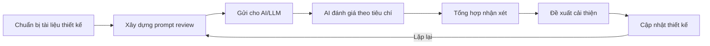

# 4.4 AI Đánh giá Thiết kế (AI Design Review)

> **Dự án:** TripMind AI – Ứng dụng lập kế hoạch du lịch thông minh bằng AI
> **Môn học:** Chuyên đề 4: AI Product Development
> **Chương:** 4 – AI trong Thiết kế Sản phẩm
> **Phiên bản tài liệu:** 1.0
> **Ngày cập nhật:** 15/09/2026

---

## 1. Mục đích

Tài liệu này áp dụng **AI để đánh giá thiết kế (AI Design Review)** của TripMind AI —
sử dụng mô hình AI (LLM) như một "chuyên gia UX/UI" để rà soát User Flow (4.1),
Wireframe (4.2) và Prototype (4.3), từ đó chỉ ra điểm mạnh, điểm yếu và đề xuất cải
thiện. Đây là ứng dụng thực tế của AI trong quy trình phát triển sản phẩm — đúng
trọng tâm môn *Chuyên đề 4: AI Product Development*.

---

## 2. Phương pháp AI Design Review

### 2.1. Quy trình



### 2.2. Bộ tiêu chí đánh giá (Evaluation Criteria)

| # | Tiêu chí | Câu hỏi đánh giá |
|---|----------|------------------|
| 1 | **Tính khả dụng (Usability)** | Người dùng có dễ hoàn thành mục tiêu không? |
| 2 | **Tính nhất quán (Consistency)** | Bố cục, nút, thuật ngữ có đồng nhất không? |
| 3 | **Phân cấp thị giác (Hierarchy)** | Thông tin quan trọng có nổi bật không? |
| 4 | **Luồng người dùng (Flow)** | Số bước có tối ưu, có bị lạc đường không? |
| 5 | **Phản hồi hệ thống (Feedback)** | Loading, lỗi, thành công có rõ ràng không? |
| 6 | **Khả năng tiếp cận (Accessibility)** | Tương phản, kích thước, mobile có ổn không? |
| 7 | **Phù hợp mục tiêu sản phẩm** | Thiết kế có phục vụ đúng giá trị cốt lõi không? |

---

## 3. Prompt sử dụng để AI review

> Đây là prompt thực tế được dùng để yêu cầu AI đánh giá thiết kế TripMind AI.

**System prompt:**

```
Bạn là một chuyên gia thiết kế UX/UI với 10 năm kinh nghiệm đánh giá sản phẩm số.
Hãy đánh giá thiết kế được cung cấp một cách khách quan, chỉ ra cả điểm mạnh lẫn
điểm yếu, và đưa ra đề xuất cải thiện cụ thể, khả thi. Chấm điểm theo thang 10 cho
từng tiêu chí.
```

**User prompt:**

```
Hãy đánh giá thiết kế của ứng dụng web "TripMind AI - lập kế hoạch du lịch bằng AI"
dựa trên:
- User Flow: [mô tả luồng 6 màn hình...]
- Wireframe: [mô tả bố cục các màn hình...]
- Prototype: [mô tả liên kết + trạng thái...]

Đánh giá theo 7 tiêu chí: Usability, Consistency, Hierarchy, Flow, Feedback,
Accessibility, Phù hợp mục tiêu. Với mỗi tiêu chí: chấm điểm /10, nêu nhận xét
và đề xuất cải thiện.
```

---

## 4. Kết quả AI đánh giá (AI Review Results)

> Kết quả tổng hợp từ phiên đánh giá của AI đối với thiết kế TripMind AI.

### 4.1. Bảng điểm theo tiêu chí

| Tiêu chí | Điểm | Nhận xét của AI |
|----------|------|-----------------|
| Usability | 8.5/10 | Luồng tạo lịch trình ngắn gọn, form tối giản 4 trường là điểm mạnh |
| Consistency | 8.0/10 | Header và card nhất quán; cần thống nhất vị trí nút chính |
| Hierarchy | 7.5/10 | Chi phí và nút "Lưu" nổi bật tốt; danh sách hoạt động hơi đều nhau |
| Flow | 9.0/10 | Số bước tối ưu, có xử lý lỗi AI và nút "Tạo lại" hợp lý |
| Feedback | 8.0/10 | Có loading/error/success; nên thêm progress cụ thể khi AI xử lý |
| Accessibility | 7.0/10 | Cần kiểm tra tương phản màu và kích thước chạm trên mobile |
| Phù hợp mục tiêu | 9.0/10 | Thiết kế bám sát giá trị "tạo lịch trình trong 5 phút" |
| **Điểm trung bình** | **8.1/10** | Thiết kế tốt ở mức MVP, còn dư địa tinh chỉnh |

### 4.2. Điểm mạnh AI ghi nhận

1. **Luồng người dùng ngắn và rõ ràng** — từ trang chủ đến lịch trình chỉ ~5 bước.
2. **Form đầu vào tối giản** — giảm rào cản, tránh "quá tải thông tin".
3. **Xử lý trạng thái tốt** — có đủ loading, empty, error, success.
4. **Tập trung vào chức năng lõi (AI)** — không bị phân tán bởi tính năng phụ.

### 4.3. Điểm yếu & vấn đề AI phát hiện

| # | Vấn đề | Mức độ | Màn hình |
|---|--------|--------|----------|
| I1 | Thời gian chờ AI có thể gây sốt ruột nếu chỉ có spinner đơn giản | Cao | S5→S6 |
| I2 | Chưa có cách so sánh nhiều phương án lịch trình cạnh nhau | Trung bình | S6 |
| I3 | Danh sách hoạt động thiếu phân biệt trực quan (ăn/chơi/di chuyển) | Trung bình | S6, S9 |
| I4 | Chưa rõ cách chỉnh sửa nhanh 1 hoạt động (inline vs màn hình riêng) | Trung bình | S7 |
| I5 | Cần kiểm tra khả năng tiếp cận (màu, kích thước nút) trên mobile | Thấp | Tất cả |

---

## 5. Đề xuất cải thiện từ AI (AI Recommendations)

| Mã | Vấn đề gốc | Đề xuất cải thiện | Ưu tiên |
|----|-----------|-------------------|---------|
| R1 | I1 | Thay spinner bằng progress bar có thông điệp tiến trình ("Đang chọn địa điểm...", "Đang tối ưu chi phí...") | Cao |
| R2 | I3 | Thêm icon/màu phân loại hoạt động (🍜 ăn uống, 📸 tham quan, 🚗 di chuyển) | Cao |
| R3 | I2 | Cho phép AI tạo 2–3 phương án và hiển thị dạng tab để so sánh | Trung bình |
| R4 | I4 | Dùng chỉnh sửa inline (bấm trực tiếp vào hoạt động để sửa) | Trung bình |
| R5 | I5 | Áp dụng chuẩn WCAG AA cho tương phản; nút chạm tối thiểu 44x44px | Trung bình |

---

## 6. So sánh trước & sau khi áp dụng AI Review

| Khía cạnh | Trước review | Sau khi áp dụng đề xuất |
|-----------|--------------|-------------------------|
| Màn hình loading | Chỉ spinner | Progress bar + thông điệp tiến trình |
| Danh sách hoạt động | Text thuần | Có icon/màu phân loại hoạt động |
| Phương án lịch trình | Chỉ 1 phương án | Có thể tạo & so sánh nhiều phương án |
| Chỉnh sửa | Màn hình riêng | Chỉnh sửa inline nhanh |
| Accessibility | Chưa kiểm chuẩn | Đạt chuẩn WCAG AA cơ bản |

---

## 7. Vai trò của AI trong quy trình thiết kế (đúc kết)

| Lợi ích | Mô tả |
|---------|-------|
| **Nhanh** | AI review toàn bộ thiết kế trong vài phút thay vì họp nhiều giờ |
| **Khách quan** | Đánh giá theo tiêu chí chuẩn, giảm thiên kiến cá nhân |
| **Đầy đủ** | Bao quát nhiều khía cạnh (usability, accessibility, flow...) |
| **Gợi ý cụ thể** | Không chỉ chỉ ra lỗi mà còn đề xuất cách sửa |

### Giới hạn cần lưu ý

- AI đánh giá dựa trên mô tả, **không thay thế** kiểm thử người dùng thực tế (user testing).
- Cần con người xác nhận lại các đề xuất trước khi áp dụng.
- AI có thể bỏ sót ngữ cảnh văn hóa/địa phương đặc thù.

---

## 8. Kết luận

Việc áp dụng AI Design Review giúp TripMind AI phát hiện sớm 5 vấn đề thiết kế và
nhận 5 đề xuất cải thiện cụ thể, nâng chất lượng trải nghiệm trước khi bước vào lập
trình. Điểm trung bình 8.1/10 cho thấy thiết kế đã vững ở mức MVP, đồng thời chỉ ra
rõ hướng tinh chỉnh tiếp theo. Đây là minh chứng cho việc **tích hợp AI xuyên suốt
quy trình phát triển sản phẩm**, không chỉ trong tính năng mà cả trong khâu thiết kế.
