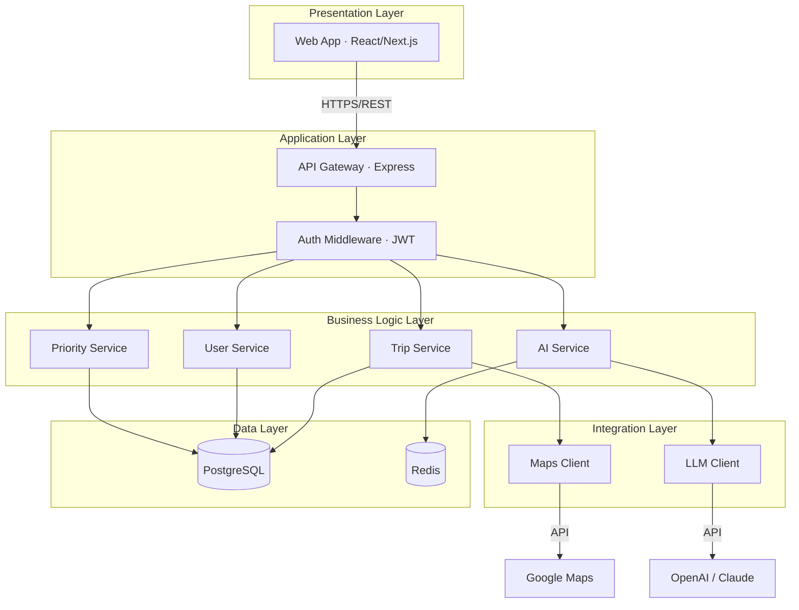
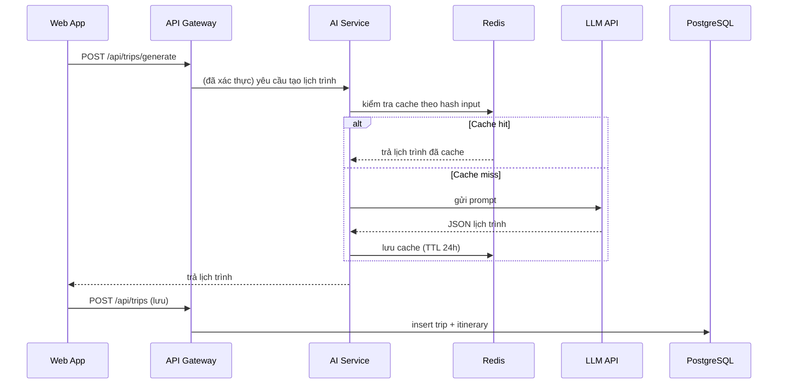

# PRD: 5.1 Thiết kế Kiến trúc (Architecture Design)

> **Dự án:** TripMind AI – Ứng dụng lập kế hoạch du lịch thông minh bằng AI
> **Môn học:** Chuyên đề 4: AI Product Development
> **Chương:** 5 – Thiết kế Kiến trúc & Hệ thống · Mục 5.1
> **Phiên bản:** 1.0 · **Ngày cập nhật:** 22/09/2026

## Introduction

Thiết kế **kiến trúc tổng thể** cho hệ thống TripMind AI, làm nền tảng cho các mục
sau của Chương 5 (patterns, UML, database, API, design patterns). Tài liệu này kế thừa
và mở rộng phần kiến trúc đã phác ở [3.6 – Kiến trúc & Công nghệ](./3.6-technical-architecture.md),
đi sâu vào phân rã thành phần, ranh giới trách nhiệm và các quyết định kiến trúc chính.

## Goals

- Xác định kiểu kiến trúc tổng thể và lý do lựa chọn.
- Phân rã hệ thống thành các thành phần với trách nhiệm rõ ràng.
- Định nghĩa cách các thành phần giao tiếp (đồng bộ/bất đồng bộ).
- Ghi lại các quyết định kiến trúc quan trọng (ADR) và đánh đổi.

## User Stories

### US-001: Xác định kiểu kiến trúc tổng thể
**Description:** Là một kiến trúc sư hệ thống, tôi muốn chọn kiểu kiến trúc phù hợp để
đội phát triển có định hướng nhất quán.

**Acceptance Criteria:**
- [ ] Nêu rõ kiểu kiến trúc (layered + client-server + tích hợp AI)
- [ ] Có sơ đồ kiến trúc tổng thể (Mermaid)
- [ ] Giải thích lý do chọn so với phương án khác (monolith vs microservices)

### US-002: Phân rã thành phần và trách nhiệm
**Description:** Là một developer, tôi muốn biết mỗi thành phần chịu trách nhiệm gì để
biết code của mình thuộc đâu.

**Acceptance Criteria:**
- [ ] Liệt kê các thành phần (frontend, API, service, integration, data)
- [ ] Mỗi thành phần có mô tả trách nhiệm và ranh giới
- [ ] Có bảng ánh xạ thành phần ↔ công nghệ

### US-003: Định nghĩa giao tiếp giữa thành phần
**Description:** Là một developer, tôi muốn biết các thành phần trao đổi dữ liệu thế nào.

**Acceptance Criteria:**
- [ ] Xác định giao tiếp đồng bộ (REST) và bất đồng bộ (queue/cache)
- [ ] Có sơ đồ luồng dữ liệu cho tính năng tạo lịch trình bằng AI
- [ ] Nêu rõ điểm tích hợp với dịch vụ bên ngoài (LLM, Maps)

### US-004: Ghi lại quyết định kiến trúc (ADR)
**Description:** Là một kiến trúc sư, tôi muốn ghi lại các quyết định quan trọng để đội
sau hiểu vì sao chọn như vậy.

**Acceptance Criteria:**
- [ ] Có tối thiểu 3 ADR (kiến trúc, AI provider, caching)
- [ ] Mỗi ADR gồm: bối cảnh, quyết định, đánh đổi

## Functional Requirements

- **FR-1:** Cung cấp sơ đồ kiến trúc tổng thể phân tầng (Mermaid).
- **FR-2:** Mô tả trách nhiệm từng thành phần + bảng ánh xạ công nghệ.
- **FR-3:** Cung cấp sơ đồ luồng dữ liệu (data flow) cho use case lõi.
- **FR-4:** Ghi lại tối thiểu 3 Architecture Decision Records.
- **FR-5:** Nêu thuộc tính chất lượng (quality attributes) hệ thống hướng tới.

## Non-Goals

- Không đi vào chi tiết pattern cụ thể (thuộc 5.2).
- Không đặc tả schema database (thuộc 5.4) hay API endpoint (thuộc 5.5).
- Không bao gồm cấu hình hạ tầng chi tiết (CI/CD, secrets).

## Technical Considerations

- Kế thừa tech stack ở 3.6: React/Next.js, Node/Express, PostgreSQL, Redis, LLM API.
- MVP ưu tiên **monolith có phân tầng** (dễ phát triển, đủ cho quy mô ban đầu).
- Tầng tích hợp AI trừu tượng hóa để dễ thay nhà cung cấp (OpenAI ↔ Claude).

## Success Metrics

- Mọi thành phần đều có trách nhiệm đơn nhất, không chồng lấn.
- Thời gian phản hồi tạo lịch trình ≤ 15s (nhờ cache + async).
- Thay đổi nhà cung cấp AI không ảnh hưởng tầng nghiệp vụ.

## Open Questions

- Khi nào nên tách "AI Service" thành service riêng (microservice)?
- Có cần message queue thật (RabbitMQ) hay Redis là đủ cho MVP?

---

## Phụ lục A – Sơ đồ kiến trúc tổng thể

## Phụ lục B – Trách nhiệm thành phần

| Thành phần | Trách nhiệm | Công nghệ |
|------------|-------------|-----------|
| Web App | Giao diện, điều hướng, hiển thị | React, Next.js, TypeScript |
| API Gateway | Định tuyến, xác thực, validate | Express, JWT |
| Trip Service | Nghiệp vụ chuyến đi & lịch trình | Node.js |
| AI Service | Dựng prompt, gọi LLM, parse kết quả | Node.js + LLM Client |
| Priority Service | Gán/lọc độ ưu tiên hoạt động | Node.js |
| User Service | Tài khoản, xác thực | Node.js + bcrypt |
| Integration | Giao tiếp dịch vụ ngoài | LLM/Maps client |
| Data | Lưu trữ & cache | PostgreSQL, Redis |

## Phụ lục C – Data flow: Tạo lịch trình bằng AI

## Phụ lục D – Architecture Decision Records (ADR)

**ADR-01: Monolith phân tầng cho MVP**
- *Bối cảnh:* Quy mô nhỏ, đội ít người, cần ra MVP nhanh.
- *Quyết định:* Dùng monolith có phân tầng thay vì microservices.
- *Đánh đổi:* Dễ phát triển/triển khai; nhưng phải tái cấu trúc khi scale lớn.

**ADR-02: Trừu tượng hóa AI provider**
- *Bối cảnh:* Có thể dùng OpenAI hoặc Claude; giá và chất lượng thay đổi.
- *Quyết định:* Tạo interface `LLMClient` chung, cài đặt riêng cho từng nhà cung cấp.
- *Đánh đổi:* Thêm một lớp trừu tượng; đổi lại dễ thay nhà cung cấp.

**ADR-03: Cache kết quả AI bằng Redis**
- *Bối cảnh:* Gọi LLM tốn tiền và chậm; nhiều yêu cầu có input giống nhau.
- *Quyết định:* Cache theo hash input, TTL 24h.
- *Đánh đổi:* Kết quả có thể hơi cũ; đổi lại giảm chi phí & tăng tốc rõ rệt.

## Phụ lục E – Thuộc tính chất lượng (Quality Attributes)

| Thuộc tính | Mục tiêu | Cách đạt |
|------------|----------|----------|
| Performance | Tạo lịch trình ≤ 15s | Cache + async |
| Scalability | Scale ngang backend | Stateless + JWT |
| Maintainability | Dễ bảo trì | Phân tầng, tách service |
| Flexibility | Đổi AI provider dễ | Interface LLMClient |
| Security | Bảo vệ dữ liệu | JWT, bcrypt, HTTPS |
