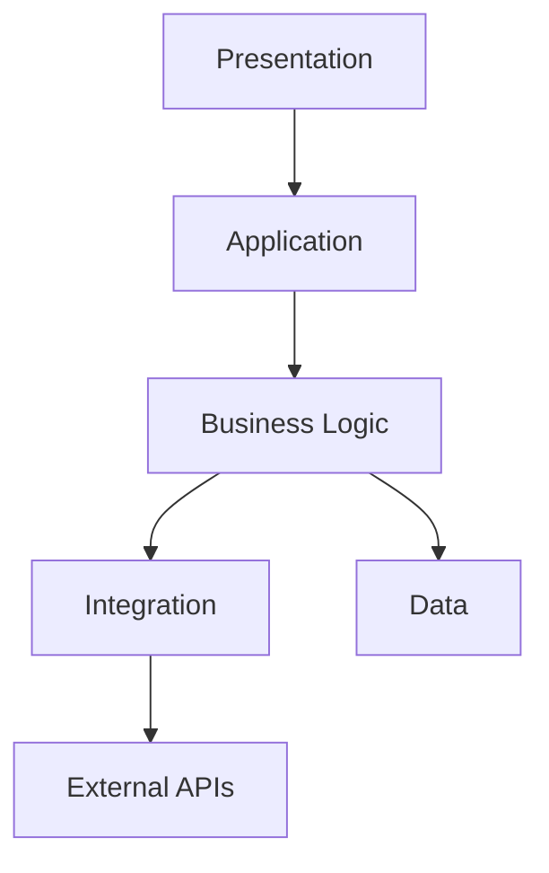
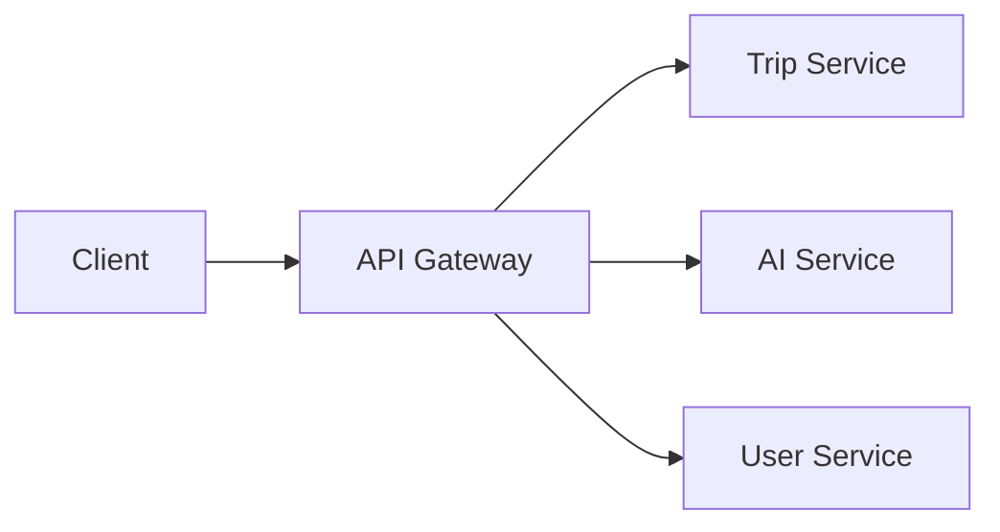

# PRD: 5.2 Các Mô hình Kiến trúc (Architecture Patterns)

> **Dự án:** TripMind AI – Ứng dụng lập kế hoạch du lịch thông minh bằng AI
> **Môn học:** Chuyên đề 4: AI Product Development
> **Chương:** 5 – Thiết kế Kiến trúc & Hệ thống · Mục 5.2
> **Phiên bản:** 1.0 · **Ngày cập nhật:** 22/09/2026

## Introduction

Xác định và lựa chọn các **mô hình kiến trúc (architecture patterns)** áp dụng cho
TripMind AI. Tài liệu so sánh các pattern phổ biến (monolith, microservices, layered,
client-server, event-driven), giải thích lựa chọn cho MVP và định hướng tiến hóa khi
hệ thống lớn dần.

## Goals

- So sánh các architecture pattern ứng viên theo tiêu chí phù hợp với TripMind AI.
- Chọn pattern chính cho MVP và giải thích lý do.
- Xác định các pattern hỗ trợ (layered, client-server, caching, gateway).
- Định hướng lộ trình tiến hóa kiến trúc.

## User Stories

### US-001: So sánh các architecture pattern
**Description:** Là một kiến trúc sư, tôi muốn so sánh các pattern để chọn đúng cho bối cảnh.

**Acceptance Criteria:**
- [ ] So sánh ≥ 4 pattern (monolith, microservices, layered, event-driven)
- [ ] Bảng so sánh theo tiêu chí (độ phức tạp, chi phí, scale, tốc độ phát triển)
- [ ] Kết luận pattern chọn cho MVP

### US-002: Áp dụng Layered Architecture
**Description:** Là một developer, tôi muốn hiểu cách phân tầng để đặt code đúng chỗ.

**Acceptance Criteria:**
- [ ] Mô tả 5 tầng (presentation, application, business, integration, data)
- [ ] Quy tắc phụ thuộc giữa các tầng
- [ ] Ví dụ ánh xạ chức năng vào tầng

### US-003: Áp dụng các pattern hỗ trợ
**Description:** Là một kiến trúc sư, tôi muốn dùng các pattern bổ trợ cho hiệu năng và bảo trì.

**Acceptance Criteria:**
- [ ] API Gateway pattern
- [ ] Cache-Aside pattern (Redis)
- [ ] Adapter pattern cho AI provider

### US-004: Định hướng tiến hóa kiến trúc
**Description:** Là một kiến trúc sư, tôi muốn biết khi nào và cách tách microservices.

**Acceptance Criteria:**
- [ ] Nêu tín hiệu (trigger) cần tách service
- [ ] Ứng viên tách đầu tiên (AI Service)
- [ ] Rủi ro khi chuyển đổi

## Functional Requirements

- **FR-1:** Bảng so sánh các architecture pattern theo tiêu chí.
- **FR-2:** Mô tả Layered Architecture với quy tắc phụ thuộc.
- **FR-3:** Mô tả các pattern hỗ trợ (Gateway, Cache-Aside, Adapter) kèm sơ đồ.
- **FR-4:** Lộ trình tiến hóa từ monolith sang service tách rời.

## Non-Goals

- Không đi vào design pattern mức code (thuộc 5.6).
- Không cấu hình triển khai chi tiết (infra as code).

## Technical Considerations

- MVP chọn **Monolith + Layered** để tối ưu tốc độ phát triển.
- Chuẩn bị sẵn ranh giới module để dễ tách service sau này.
- Redis đóng vai trò cache và có thể mở rộng thành message broker nhẹ.

## Success Metrics

- Pattern chọn giúp ra MVP nhanh, code có ranh giới rõ ràng.
- Có thể tách AI Service thành service riêng mà ít phải sửa nghiệp vụ khác.

## Open Questions

- Có nên áp dụng CQRS cho phần đọc lịch trình nhiều không?
- Event-driven có cần thiết cho thông báo/nhắc lịch ở bản sau không?

---

## Phụ lục A – So sánh Architecture Patterns

| Pattern | Ưu điểm | Nhược điểm | Phù hợp TripMind AI? |
|---------|---------|------------|----------------------|
| **Monolith** | Đơn giản, dev/deploy nhanh | Khó scale từng phần | ✅ Chọn cho MVP |
| **Layered** | Tách trách nhiệm rõ | Có thể cứng nhắc | ✅ Áp dụng cùng monolith |
| **Microservices** | Scale độc lập, đội lớn | Phức tạp, tốn chi phí vận hành | ⏳ Giai đoạn sau |
| **Event-driven** | Bất đồng bộ, mở rộng tốt | Khó debug, phức tạp | ⏳ Cho tính năng nhắc lịch |
| **Client-Server** | Tách FE/BE rõ | – | ✅ Nền tảng mặc định |

**Kết luận:** MVP dùng **Monolith + Layered + Client-Server**, bổ sung **API Gateway**,
**Cache-Aside**, **Adapter (AI)**. Microservices và event-driven để dành cho giai đoạn scale.

## Phụ lục B – Layered Architecture & quy tắc phụ thuộc



**Quy tắc:** Tầng trên chỉ gọi tầng ngay dưới; không gọi ngược lên; không "nhảy cóc"
qua nhiều tầng. Business Logic không biết chi tiết HTTP; Data không chứa nghiệp vụ.

| Tầng | Ví dụ chức năng TripMind AI |
|------|-----------------------------|
| Presentation | Màn hình lịch trình, filter Priority |
| Application | Route `/api/trips`, xác thực JWT |
| Business | Trip Service, AI Service, Priority Service |
| Integration | LLM Client, Maps Client |
| Data | Repository truy vấn PostgreSQL, Redis |

## Phụ lục C – Các pattern hỗ trợ

### API Gateway Pattern
Một điểm vào duy nhất cho mọi request: xác thực, định tuyến, rate limit.



### Cache-Aside Pattern (Redis)
Ứng dụng đọc cache trước; miss thì đọc nguồn và ghi lại cache.

```
đọc(key):
  v = cache.get(key)
  nếu v tồn tại: trả v
  ngược lại:
    v = nguồn.load(key)     # gọi LLM
    cache.set(key, v, TTL)
    trả v
```

### Adapter Pattern cho AI provider
Interface chung, cài đặt riêng cho từng nhà cung cấp (chi tiết ở 5.6).

```
interface LLMClient { generateItinerary(input): Itinerary }
class OpenAIClient implements LLMClient { ... }
class ClaudeClient implements LLMClient { ... }
```

## Phụ lục D – Lộ trình tiến hóa kiến trúc

| Giai đoạn | Kiến trúc | Trigger chuyển đổi |
|-----------|-----------|--------------------|
| MVP | Monolith + Layered | – |
| Tăng trưởng | Tách **AI Service** thành service riêng | Chi phí AI cao, cần scale riêng phần AI |
| Quy mô lớn | Microservices + Event-driven | Đội lớn, nhiều tính năng, cần scale độc lập |

**Rủi ro khi tách service:** tăng độ phức tạp vận hành, cần xử lý giao tiếp mạng, nhất
quán dữ liệu phân tán. → Chỉ tách khi có tín hiệu rõ ràng, không tách sớm.
