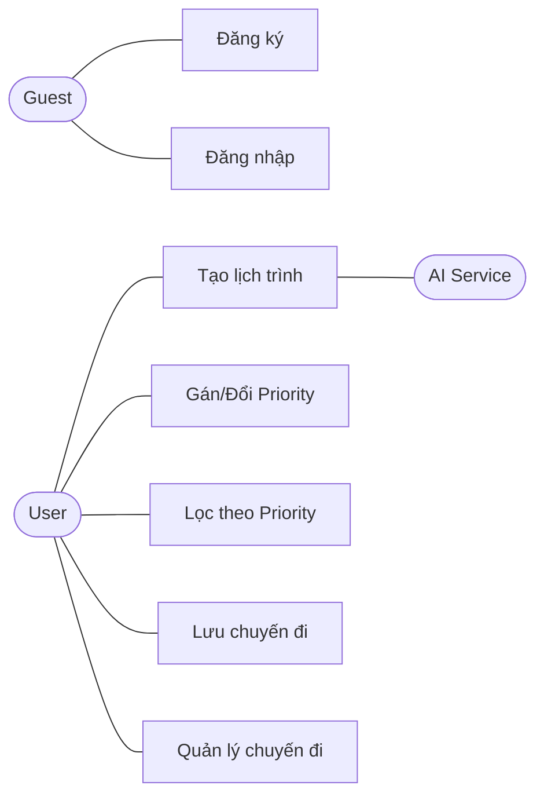
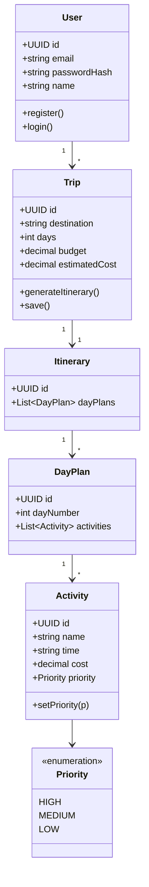
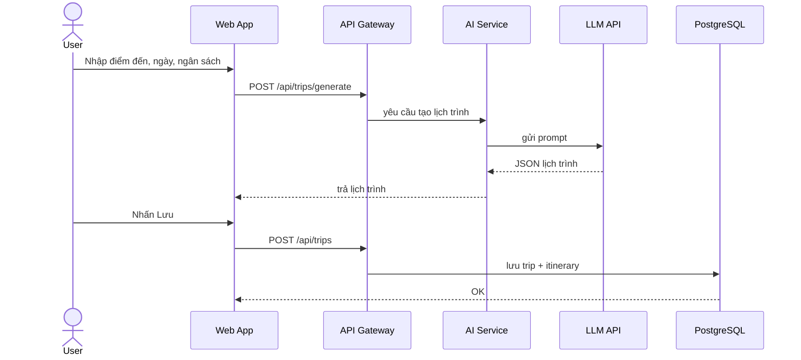
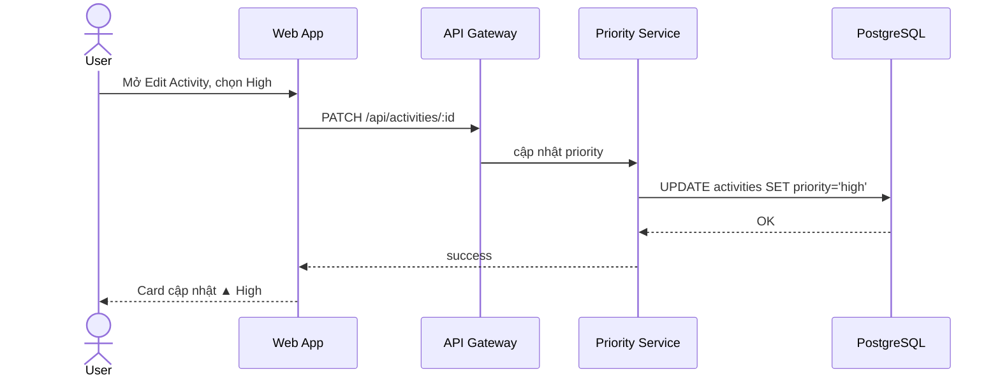
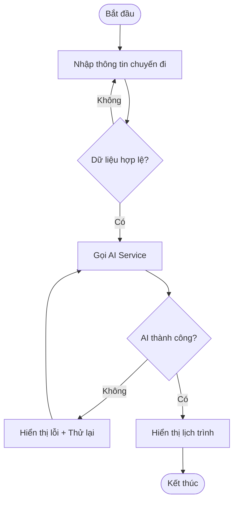
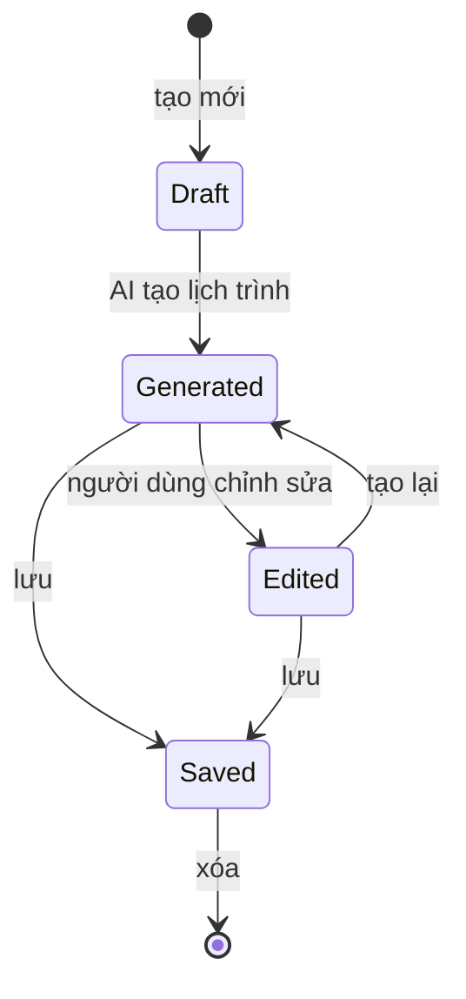

# PRD: 5.3 Mô hình hóa Hệ thống & UML (System Modeling & UML)

> **Dự án:** TripMind AI – Ứng dụng lập kế hoạch du lịch thông minh bằng AI
> **Môn học:** Chuyên đề 4: AI Product Development
> **Chương:** 5 – Thiết kế Kiến trúc & Hệ thống · Mục 5.3
> **Phiên bản:** 1.0 · **Ngày cập nhật:** 22/09/2026

## Introduction

Mô hình hóa hệ thống TripMind AI bằng các sơ đồ **UML** để trực quan hóa cấu trúc và
hành vi: Use Case, Class, Sequence, Activity và State. Các sơ đồ dùng Mermaid để hiển
thị trực tiếp trên GitHub, kế thừa use case và mô hình dữ liệu đã nêu ở 3.3 và 3.6.

## Goals

- Biểu diễn chức năng hệ thống qua Use Case Diagram.
- Biểu diễn cấu trúc tĩnh qua Class Diagram.
- Biểu diễn hành vi động qua Sequence + Activity + State Diagram.
- Bao phủ cả tính năng lõi (tạo lịch trình) và tính năng Priority (Chương 4).

## User Stories

### US-001: Use Case Diagram
**Description:** Là một BA, tôi muốn sơ đồ use case để thấy tác nhân và chức năng.

**Acceptance Criteria:**
- [ ] Có các actor: Guest, User, AI Service
- [ ] Bao phủ use case chính: đăng ký, tạo lịch trình, gán/lọc Priority, lưu chuyến đi
- [ ] Vẽ bằng Mermaid

### US-002: Class Diagram
**Description:** Là một developer, tôi muốn class diagram để hiểu cấu trúc đối tượng.

**Acceptance Criteria:**
- [ ] Có các class: User, Trip, Itinerary, DayPlan, Activity (kèm Priority)
- [ ] Thể hiện thuộc tính, phương thức chính và quan hệ
- [ ] Nhất quán với mô hình dữ liệu 3.6

### US-003: Sequence Diagram
**Description:** Là một developer, tôi muốn sequence diagram cho luồng quan trọng.

**Acceptance Criteria:**
- [ ] Sequence cho "tạo lịch trình bằng AI"
- [ ] Sequence cho "thay đổi Priority hoạt động"
- [ ] Thể hiện rõ các thành phần tham gia

### US-004: Activity & State Diagram
**Description:** Là một developer, tôi muốn activity/state diagram để hiểu quy trình và trạng thái.

**Acceptance Criteria:**
- [ ] Activity diagram cho quy trình tạo lịch trình (gồm nhánh lỗi)
- [ ] State diagram cho vòng đời một Trip

## Functional Requirements

- **FR-1:** Use Case Diagram (Mermaid).
- **FR-2:** Class Diagram với thuộc tính, phương thức, quan hệ.
- **FR-3:** 2 Sequence Diagram (tạo lịch trình, đổi Priority).
- **FR-4:** Activity Diagram + State Diagram.

## Non-Goals

- Không đặc tả chi tiết schema DB (thuộc 5.4) hay API (thuộc 5.5).
- Không vẽ deployment diagram (đã có ở 3.6).

## Technical Considerations

- Dùng Mermaid: `classDiagram`, `sequenceDiagram`, `stateDiagram-v2`, `flowchart`.
- Giữ tên class/thuộc tính nhất quán với ERD ở 5.4.

## Success Metrics

- Mỗi tính năng chính có ≥ 1 sơ đồ hành vi tương ứng.
- Class Diagram khớp 100% với bảng database ở 5.4.

## Open Questions

- Có cần Component Diagram riêng ngoài sơ đồ kiến trúc 5.1 không?
- Priority nên là enum hay class riêng trong mô hình đối tượng?

---

## Phụ lục A – Use Case Diagram

## Phụ lục B – Class Diagram

## Phụ lục C – Sequence Diagram: Tạo lịch trình bằng AI

## Phụ lục D – Sequence Diagram: Đổi Priority hoạt động

## Phụ lục E – Activity Diagram: Quy trình tạo lịch trình

## Phụ lục F – State Diagram: Vòng đời một Trip

