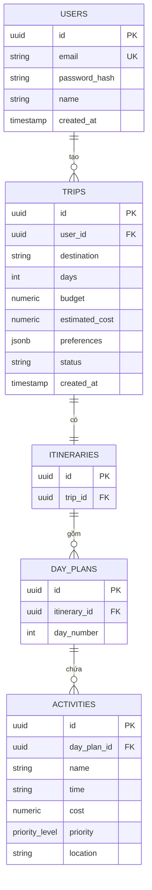

# PRD: 5.4 Thiết kế Cơ sở Dữ liệu (Database Design)

> **Dự án:** TripMind AI – Ứng dụng lập kế hoạch du lịch thông minh bằng AI
> **Môn học:** Chuyên đề 4: AI Product Development
> **Chương:** 5 – Thiết kế Kiến trúc & Hệ thống · Mục 5.4
> **Phiên bản:** 1.0 · **Ngày cập nhật:** 22/09/2026

## Introduction

Thiết kế **cơ sở dữ liệu** cho TripMind AI trên PostgreSQL: mô hình quan hệ, schema
chi tiết (kèm SQL), chuẩn hóa, chỉ mục và ràng buộc. Bao gồm cả trường `priority` cho
hoạt động (tính năng Chương 4), nhất quán với ERD ở 3.6 và Class Diagram ở 5.3.

## Goals

- Thiết kế schema quan hệ chuẩn hóa (3NF) cho các thực thể chính.
- Cung cấp SQL DDL đầy đủ (CREATE TABLE) kèm ràng buộc.
- Định nghĩa chỉ mục (index) phục vụ truy vấn thường gặp.
- Đưa ra chiến lược migration và dữ liệu mẫu.

## User Stories

### US-001: Thiết kế bảng và quan hệ
**Description:** Là một developer, tôi muốn schema rõ ràng để lưu người dùng, chuyến đi, lịch trình.

**Acceptance Criteria:**
- [ ] Có bảng: users, trips, itineraries, day_plans, activities
- [ ] Khóa chính/ngoại đầy đủ, ràng buộc hợp lý
- [ ] ERD thể hiện quan hệ (Mermaid)

### US-002: Thêm trường priority cho activities
**Description:** Là một developer, tôi cần lưu độ ưu tiên hoạt động để hỗ trợ tính năng Priority.

**Acceptance Criteria:**
- [ ] Cột `priority` kiểu enum ('high'|'medium'|'low'), mặc định 'medium'
- [ ] Có index phục vụ lọc theo priority
- [ ] Migration thêm cột chạy được

### US-003: Chỉ mục & tối ưu truy vấn
**Description:** Là một developer, tôi muốn truy vấn danh sách chuyến đi/hoạt động nhanh.

**Acceptance Criteria:**
- [ ] Index trên khóa ngoại thường join
- [ ] Index phục vụ lọc theo user, theo priority
- [ ] Nêu truy vấn mẫu hưởng lợi từ index

### US-004: Migration & seed data
**Description:** Là một developer, tôi muốn quy trình migration và dữ liệu mẫu để phát triển.

**Acceptance Criteria:**
- [ ] Có thứ tự migration rõ ràng
- [ ] Có script seed dữ liệu mẫu
- [ ] Có cách rollback

## Functional Requirements

- **FR-1:** ERD đầy đủ (Mermaid) cho 5 bảng chính.
- **FR-2:** SQL DDL (CREATE TABLE) kèm khóa, ràng buộc, enum.
- **FR-3:** Định nghĩa index cho các truy vấn thường gặp.
- **FR-4:** Chiến lược migration + seed + rollback.
- **FR-5:** Ghi chú chuẩn hóa (normalization) đạt 3NF.

## Non-Goals

- Không thiết kế cache schema (Redis là key-value, nêu ngắn ở 5.1).
- Không tối ưu phân mảnh/sharding (chưa cần ở MVP).

## Technical Considerations

- PostgreSQL 15, dùng UUID làm khóa chính (`gen_random_uuid()`).
- Enum cho priority và status để ràng buộc giá trị hợp lệ.
- Dùng Prisma làm ORM/migration (nêu ở 3.6), nhưng tài liệu này viết SQL thuần để rõ ràng.

## Success Metrics

- Schema đạt 3NF, không dư thừa dữ liệu.
- Truy vấn danh sách chuyến đi của user < 50ms với index.
- Lọc hoạt động theo priority dùng index, không full-scan.

## Open Questions

- Tags nên là bảng riêng (many-to-many) hay cột JSON trên activities?
- Có nên lưu snapshot JSON của lịch trình AI gốc để đối chiếu không?

---

## Phụ lục A – ERD



## Phụ lục B – SQL DDL

```sql
-- Enum cho độ ưu tiên và trạng thái
CREATE TYPE priority_level AS ENUM ('high', 'medium', 'low');
CREATE TYPE trip_status AS ENUM ('draft', 'generated', 'saved');

-- Bảng người dùng
CREATE TABLE users (
    id            UUID PRIMARY KEY DEFAULT gen_random_uuid(),
    email         VARCHAR(255) NOT NULL UNIQUE,
    password_hash VARCHAR(255) NOT NULL,
    name          VARCHAR(100),
    created_at    TIMESTAMPTZ NOT NULL DEFAULT now()
);

-- Bảng chuyến đi
CREATE TABLE trips (
    id             UUID PRIMARY KEY DEFAULT gen_random_uuid(),
    user_id        UUID NOT NULL REFERENCES users(id) ON DELETE CASCADE,
    destination    VARCHAR(255) NOT NULL,
    days           INT NOT NULL CHECK (days BETWEEN 1 AND 30),
    budget         NUMERIC(12,2) NOT NULL CHECK (budget > 0),
    estimated_cost NUMERIC(12,2) DEFAULT 0,
    preferences    JSONB DEFAULT '[]',
    status         trip_status NOT NULL DEFAULT 'draft',
    created_at     TIMESTAMPTZ NOT NULL DEFAULT now()
);

-- Bảng lịch trình (1-1 với trip)
CREATE TABLE itineraries (
    id       UUID PRIMARY KEY DEFAULT gen_random_uuid(),
    trip_id  UUID NOT NULL UNIQUE REFERENCES trips(id) ON DELETE CASCADE
);

-- Kế hoạch từng ngày
CREATE TABLE day_plans (
    id             UUID PRIMARY KEY DEFAULT gen_random_uuid(),
    itinerary_id   UUID NOT NULL REFERENCES itineraries(id) ON DELETE CASCADE,
    day_number     INT NOT NULL CHECK (day_number >= 1),
    UNIQUE (itinerary_id, day_number)
);

-- Hoạt động trong ngày (có priority)
CREATE TABLE activities (
    id          UUID PRIMARY KEY DEFAULT gen_random_uuid(),
    day_plan_id UUID NOT NULL REFERENCES day_plans(id) ON DELETE CASCADE,
    name        VARCHAR(255) NOT NULL,
    time        VARCHAR(10),
    location    VARCHAR(255),
    cost        NUMERIC(12,2) DEFAULT 0,
    priority    priority_level NOT NULL DEFAULT 'medium'
);
```

## Phụ lục C – Index

```sql
-- Truy vấn chuyến đi theo user (rất thường gặp)
CREATE INDEX idx_trips_user_id ON trips(user_id);

-- Join lịch trình → ngày → hoạt động
CREATE INDEX idx_dayplans_itinerary ON day_plans(itinerary_id);
CREATE INDEX idx_activities_dayplan ON activities(day_plan_id);

-- Lọc hoạt động theo priority (tính năng Chương 4)
CREATE INDEX idx_activities_priority ON activities(day_plan_id, priority);
```

**Truy vấn mẫu hưởng lợi từ index:**

```sql
-- Danh sách chuyến đi của một user
SELECT * FROM trips WHERE user_id = $1 ORDER BY created_at DESC;

-- Các hoạt động High của một lịch trình
SELECT a.* FROM activities a
JOIN day_plans d ON a.day_plan_id = d.id
WHERE d.itinerary_id = $1 AND a.priority = 'high';
```

## Phụ lục D – Chuẩn hóa (Normalization)

| Chuẩn | Đạt? | Ghi chú |
|-------|------|---------|
| 1NF | ✅ | Mỗi cột nguyên tử, không lặp nhóm |
| 2NF | ✅ | Không phụ thuộc một phần khóa |
| 3NF | ✅ | Không phụ thuộc bắc cầu; tách thành 5 bảng |

Ví dụ: tách `activities` khỏi `day_plans` để tránh lặp thông tin ngày; `preferences`
dùng JSONB vì là danh sách sở thích linh hoạt, không cần join.

## Phụ lục E – Migration & Seed

**Thứ tự migration:**
1. `001_create_enums` — tạo `priority_level`, `trip_status`.
2. `002_create_users`
3. `003_create_trips`
4. `004_create_itineraries_dayplans`
5. `005_create_activities`
6. `006_create_indexes`

**Seed mẫu:**

```sql
INSERT INTO users (email, password_hash, name)
VALUES ('demo@tripmind.ai', '$2b$...', 'Demo User');
```

**Rollback:** mỗi migration có bước `DOWN` (ví dụ `DROP TABLE activities;`,
`DROP TYPE priority_level;`) chạy ngược thứ tự.
