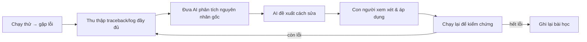

# PRD: 6.3 AI Sửa lỗi (Debugging)

> **Dự án:** TripMind AI – Ứng dụng lập kế hoạch du lịch thông minh bằng AI
> **Môn học:** Chuyên đề 4: AI Product Development
> **Chương:** 6 – Lập trình cùng AI · Mục 6.3
> **Phiên bản:** 1.0 · **Ngày cập nhật:** 29/09/2026

## Introduction

Tài liệu trình bày việc **dùng AI để sửa lỗi (debugging)** trong quá trình xây dựng
TripMind AI. Đặc biệt, tài liệu dùng **2 bug có thật** đã gặp khi chạy thử code (do AI
sinh) làm case study — cho thấy quy trình đọc lỗi → chẩn đoán → sửa → kiểm chứng.

## Goals

- Trình bày quy trình debug cùng AI (đọc traceback → tìm nguyên nhân → sửa → verify).
- Dùng bug thật làm dẫn chứng, không bịa.
- Rút ra bài học về việc kiểm chứng code AI sinh.

## User Stories

### US-001: Debug lỗi thiếu dependency
**Description:** Là một developer, tôi gặp lỗi khi chạy và muốn AI giúp tìm nguyên nhân + cách sửa.

**Acceptance Criteria:**
- [ ] Có traceback thật
- [ ] Chẩn đoán đúng nguyên nhân
- [ ] Cách sửa + kiểm chứng lại

### US-002: Debug lỗi tương thích thư viện
**Description:** Là một developer, tôi gặp lỗi runtime khó hiểu và muốn AI phân tích.

**Acceptance Criteria:**
- [ ] Có log lỗi thật
- [ ] Xác định đúng gốc rễ (không chỉ triệu chứng)
- [ ] Giải pháp thay thế + verify

### US-003: Rút ra quy trình debug
**Description:** Là một người học, tôi muốn quy trình debug cùng AI có thể tái sử dụng.

**Acceptance Criteria:**
- [ ] Quy trình các bước rõ ràng
- [ ] Nêu vai trò con người trong việc xác nhận

## Functional Requirements

- **FR-1:** Trình bày 2 case study bug thật (traceback + chẩn đoán + fix + verify).
- **FR-2:** Đưa ra quy trình debug cùng AI dạng các bước.
- **FR-3:** Rút ra bài học kiểm chứng.

## Non-Goals

- Không liệt kê mọi loại lỗi; chỉ dùng lỗi thật gặp phải.
- Không bàn code generation (6.1).

## Technical Considerations

- Debug hiệu quả cần **log/traceback đầy đủ** để AI có ngữ cảnh.
- AI có thể chẩn đoán nhanh nhưng **con người xác nhận và chạy lại** để chắc chắn.

## Success Metrics

- Cả 2 bug được sửa và verify chạy lại thành công.
- Quy trình debug tái sử dụng được cho lỗi khác.

## Open Questions

- Khi nào nên tin fix của AI ngay, khi nào cần thử nhiều phương án?
- Có nên viết test để tránh bug tái diễn không?

---

## Phụ lục A – Case study 1: Thiếu `email-validator`

**Triệu chứng:** Khi khởi động backend, import thất bại.

**Traceback thật:**

```
ImportError: email-validator is not installed, run `pip install 'pydantic[email]'`
  ... File "models.py", line 10, in <module>
      class RegisterIn(BaseModel):
      email: EmailStr
```

**Chẩn đoán (AI):** Model dùng `EmailStr` của Pydantic, kiểu này yêu cầu gói phụ
`email-validator` nhưng chưa được khai báo trong `requirements.txt`.

**Cách sửa:** thêm dependency và cài:

```diff
  pydantic>=2.9.0
+ email-validator>=2.0.0
```

**Kiểm chứng:** import lại thành công → `Import OK: TripMind AI API 1.0.0`.

## Phụ lục B – Case study 2: Lỗi tương thích `passlib` + `bcrypt`

**Triệu chứng:** Endpoint `/auth/register` trả `500 Internal Server Error`.

**Log lỗi thật:**

```
ValueError: password cannot be longer than 72 bytes, truncate manually if necessary
  ... File "passlib/handlers/bcrypt.py", line 655, in _calc_checksum
      hash = _bcrypt.hashpw(secret, config)
```

**Chẩn đoán (AI):** Đây là lỗi **tương thích giữa `passlib` và bản `bcrypt` mới** — một
lỗi phổ biến; `passlib` gọi vào `bcrypt` theo cách bản mới không còn hỗ trợ, kích hoạt
kiểm tra 72-byte ngay cả với mật khẩu ngắn. Đây là **nguyên nhân gốc**, không phải do
mật khẩu người dùng quá dài (triệu chứng gây hiểu nhầm).

**Cách sửa:** bỏ `passlib`, dùng trực tiếp thư viện `bcrypt` (ổn định hơn), và cắt an
toàn 72 byte theo đúng giới hạn thuật toán:

```diff
- from passlib.context import CryptContext
- pwd_context = CryptContext(schemes=["bcrypt"], deprecated="auto")
- def hash_password(password): return pwd_context.hash(password)
+ import bcrypt
+ def hash_password(password: str) -> str:
+     pw = password.encode("utf-8")[:72]          # bcrypt giới hạn 72 byte
+     return bcrypt.hashpw(pw, bcrypt.gensalt()).decode("utf-8")
```

**Kiểm chứng:** đăng ký lại → trả token thành công; login/generate/save đều chạy.

## Phụ lục C – Quy trình Debug cùng AI



| Bước | Vai trò AI | Vai trò con người |
|------|-----------|-------------------|
| Thu thập lỗi | – | Cung cấp traceback đầy đủ |
| Chẩn đoán | Phân tích nguyên nhân gốc | Đánh giá hợp lý không |
| Đề xuất fix | Đưa giải pháp | Chọn giải pháp phù hợp |
| Kiểm chứng | Gợi ý cách test | **Chạy lại, xác nhận** |

> **Bài học:** AI chẩn đoán rất nhanh khi có log đầy đủ, nhưng **triệu chứng có thể gây
> hiểu nhầm** (lỗi "72 bytes" không phải do mật khẩu dài). Con người phải **chạy lại để
> xác nhận**, và nên phân biệt nguyên nhân gốc với triệu chứng bề mặt.
