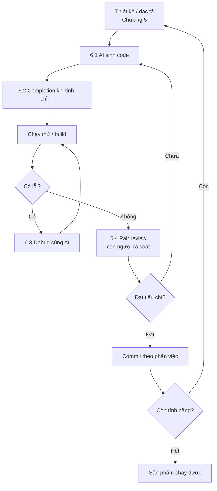

# PRD: 6.5 Quy trình Lập trình cùng AI (AI-Assisted Development Workflow)

> **Dự án:** TripMind AI – Ứng dụng lập kế hoạch du lịch thông minh bằng AI
> **Môn học:** Chuyên đề 4: AI Product Development
> **Chương:** 6 – Lập trình cùng AI · Mục 6.5
> **Phiên bản:** 1.0 · **Ngày cập nhật:** 29/09/2026

## Introduction

Tài liệu tổng kết **quy trình lập trình cùng AI** áp dụng xuyên suốt Chương 6 để xây
dựng TripMind AI — kết nối code generation (6.1), completion (6.2), debugging (6.3) và
pair programming (6.4) thành một vòng làm việc hoàn chỉnh, có kiểm soát của con người.

## Goals

- Định nghĩa quy trình end-to-end lập trình cùng AI.
- Kết nối các kỹ thuật 6.1–6.4 vào một vòng lặp.
- Nêu rõ điểm kiểm soát (checkpoint) của con người và cách quản lý chất lượng.

## User Stories

### US-001: Quy trình end-to-end
**Description:** Là một developer, tôi muốn một quy trình rõ ràng từ thiết kế đến code chạy được.

**Acceptance Criteria:**
- [ ] Quy trình có các giai đoạn nối tiếp (thiết kế → sinh → chạy → sửa → commit)
- [ ] Có sơ đồ quy trình (Mermaid)
- [ ] Gắn mỗi giai đoạn với kỹ thuật 6.1–6.4

### US-002: Điểm kiểm soát của con người
**Description:** Là một team lead, tôi muốn biết con người kiểm soát ở đâu trong quy trình.

**Acceptance Criteria:**
- [ ] Liệt kê các checkpoint bắt buộc con người xác nhận
- [ ] Nêu tiêu chí chấp nhận code

### US-003: Quản lý chất lượng & version
**Description:** Là một developer, tôi muốn quy trình đảm bảo chất lượng và lịch sử rõ ràng.

**Acceptance Criteria:**
- [ ] Nêu cách kiểm chứng (chạy thử, build, test)
- [ ] Nêu quy ước commit theo phần việc hoàn thành

## Functional Requirements

- **FR-1:** Sơ đồ quy trình end-to-end (Mermaid).
- **FR-2:** Bảng ánh xạ giai đoạn ↔ kỹ thuật 6.1–6.4.
- **FR-3:** Danh sách checkpoint của con người.
- **FR-4:** Quy ước kiểm chứng & commit.

## Non-Goals

- Không thay thế quy trình CI/CD đầy đủ của sản xuất.
- Không lặp lại chi tiết từng kỹ thuật (đã có ở 6.1–6.4).

## Technical Considerations

- Quy trình lặp (iterative): mỗi vòng cho ra một phần chạy được rồi mới đi tiếp.
- Kiểm chứng là **bắt buộc** ở mỗi vòng (chạy thử/build), không tích lũy code chưa test.

## Success Metrics

- Mỗi vòng kết thúc bằng phần code chạy được + 1 commit rõ ràng.
- Không có code chưa kiểm chứng bị đẩy vào nhánh chính.

## Open Questions

- Nên tự động hóa kiểm chứng bằng test/CI tới mức nào?
- Khi nào nên dừng để con người review kỹ thay vì đi nhanh?

---

## Phụ lục A – Sơ đồ quy trình lập trình cùng AI



## Phụ lục B – Ánh xạ giai đoạn ↔ kỹ thuật

| Giai đoạn | Kỹ thuật | Ví dụ trong TripMind AI |
|-----------|----------|--------------------------|
| Sinh code từ thiết kế | 6.1 Code Generation | Sinh db.py, main.py từ 5.4/5.5 |
| Tinh chỉnh khi gõ | 6.2 Code Completion | Hoàn thành mapping row→dict, JSX |
| Chạy thử phát hiện lỗi | 6.3 Debugging | Sửa email-validator, bcrypt |
| Rà soát & định hướng | 6.4 Pair Programming | Navigator kiểm ownership, UX |
| Lưu mốc | Quy ước commit | `feat: xong app full-stack` |

## Phụ lục C – Checkpoint của con người (bắt buộc)

| Checkpoint | Con người kiểm gì | Tiêu chí chấp nhận |
|------------|-------------------|--------------------|
| Sau khi AI sinh code | Có bám thiết kế không | Khớp schema/API Chương 5 |
| Trước khi tin fix | Nguyên nhân gốc đúng không | Không chỉ chữa triệu chứng |
| Trước khi commit | Đã chạy thử chưa | Server chạy / build pass / endpoint đúng |
| Trước khi merge | Có phá gì cũ không | Luồng chính vẫn hoạt động |

## Phụ lục D – Kiểm chứng & Commit

**Kiểm chứng mỗi vòng:**
- Backend: khởi động server + test endpoint (curl) → phải xanh.
- Frontend: `npm run build` (typecheck) → không lỗi.
- Luồng chính: register → generate → save → đổi priority → phải thông suốt.

**Quy ước commit** (theo `CLAUDE.md` của dự án): ngắn gọn, ghi phần việc hoàn thành.

```
feat: xong app full-stack TripMind AI
docs: xong 6.1 6.2 6.3
```

## Phụ lục E – Kết luận

Quy trình lập trình cùng AI của TripMind AI là một **vòng lặp có kiểm soát**: AI tăng
tốc ở khâu sinh và hoàn thành code, hỗ trợ chẩn đoán lỗi; con người giữ vai định hướng
thiết kế, xác nhận nguyên nhân lỗi, và **bắt buộc kiểm chứng trước khi commit**. Nhờ đó,
sản phẩm ([`apps/`](../apps)) vừa được xây nhanh, vừa chạy được thật và bám sát thiết
kế các chương trước — đúng tinh thần *AI mở rộng năng lực, con người chịu trách nhiệm*.
