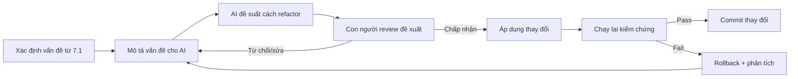

# PRD: 7.2 Tái cấu trúc Mã nguồn có AI Hỗ trợ (AI-Assisted Refactoring)

> **Dự án:** TripMind AI – Ứng dụng lập kế hoạch du lịch thông minh bằng AI
> **Môn học:** Chuyên đề 4: AI Product Development
> **Chương:** 7 – Tái cấu trúc & Review Mã nguồn cùng AI · Mục 7.2
> **Phiên bản:** 1.0 · **Ngày cập nhật:** 07/10/2026

## Introduction

Tài liệu này trình bày quá trình **tái cấu trúc mã nguồn (refactoring) có sự hỗ trợ của AI**
trong dự án TripMind AI. Dựa trên kết quả đánh giá chất lượng ở 7.1, AI và developer cùng
nhau cải thiện cấu trúc code mà **không thay đổi hành vi bên ngoài** — áp dụng nguyên tắc
"refactoring an toàn": vẫn chạy được, vẫn pass test, nhưng code sạch hơn và dễ bảo trì hơn.

## Goals

- Thực hiện ít nhất 2 refactoring có ý nghĩa dựa trên khuyến nghị từ 7.1.
- Ghi lại prompt, code trước/sau, và cách kiểm chứng không phá vỡ chức năng.
- Hiểu rõ vai trò AI trong việc đề xuất + thực thi refactoring.

## User Stories

### US-001: Tái cấu trúc logic AI Service
**Description:** Là một developer, tôi muốn đơn giản hóa logic sinh lịch trình trong
`ai_service.py` để dễ đọc và ít bug hơn.

**Acceptance Criteria:**
- [ ] Logic vòng lặp phân bổ hoạt động được đơn giản hóa
- [ ] Kết quả sinh lịch trình không thay đổi (backward compatible)
- [ ] Thêm docstring giải thích thuật toán mới

### US-002: Tách component frontend
**Description:** Là một developer, tôi muốn tách `App.tsx` thành các component riêng
để dễ bảo trì và mở rộng.

**Acceptance Criteria:**
- [ ] Mỗi component nằm trong file riêng
- [ ] UI hiển thị và hoạt động như cũ
- [ ] Import/export đúng, không lỗi TypeScript

### US-003: Ghi lại quy trình refactoring cùng AI
**Description:** Là một người học, tôi muốn ghi lại quy trình để có thể tái sử dụng
khi refactoring các module khác.

**Acceptance Criteria:**
- [ ] Có prompt mẫu cho từng loại refactoring
- [ ] Có checklist kiểm chứng sau refactoring
- [ ] Rút ra bài học

## Functional Requirements

- **FR-1:** Refactoring `ai_service.py` — đơn giản hóa thuật toán phân bổ hoạt động.
- **FR-2:** Refactoring `App.tsx` — tách 3 component ra file riêng.
- **FR-3:** Cải thiện type annotation trong `main.py`.
- **FR-4:** Ghi lại diff trước/sau cho mỗi refactoring.

## Non-Goals

- Không thêm tính năng mới trong quá trình refactoring.
- Không đổi API interface hay schema database.
- Không bàn code smell detection (thuộc 7.3).

## Technical Considerations

- Nguyên tắc "refactoring an toàn": hành vi bên ngoài không đổi.
- Kiểm chứng bằng cách chạy lại app và kiểm tra thủ công sau mỗi lần refactor.
- AI đề xuất — con người review và quyết định có áp dụng không.

## Success Metrics

- Ít nhất 2 refactoring hoàn thành và kiểm chứng thành công.
- Điểm Maintainability tăng so với đánh giá 7.1.

## Open Questions

- Khi nào nên dừng refactoring để tránh over-engineering?
- Có nên viết unit test trước khi refactor (TDD ngược) không?

---

## Phụ lục A – Refactoring 1: Đơn giản hóa `ai_service.py`

**Vấn đề gốc** (từ đánh giá 7.1): Logic phân bổ hoạt động theo ngày dùng điều kiện
modulo phức tạp, khó đọc và dễ sinh bug khi số ngày > số hoạt động trong pool.

**Prompt gửi AI:**

```
Hàm generate_itinerary trong ai_service.py dùng điều kiện:
    if i % days == (day - 1) % max(len(pool), 1) or len(pool) <= days:
để phân bổ hoạt động theo ngày. Điều kiện này khó đọc và có thể lặp lại hoạt động
không đều. Hãy refactor lại thuật toán phân bổ: mỗi ngày lấy các hoạt động theo
round-robin từ pool, đảm bảo mỗi ngày luôn có ít nhất 1 hoạt động, và code dễ đọc hơn.
Giữ nguyên interface (input/output) của hàm.
```

**Code TRƯỚC refactoring:**

```python
itinerary = []
total = 0.0
for day in range(1, days + 1):
    day_activities = []
    for i, act in enumerate(pool):
        if i % days == (day - 1) % max(len(pool), 1) or len(pool) <= days:
            day_activities.append(dict(act))
            total += act["cost"]
    if not day_activities:  # đảm bảo ngày nào cũng có ít nhất 1 hoạt động
        act = dict(pool[(day - 1) % len(pool)])
        day_activities.append(act)
        total += act["cost"]
    itinerary.append({"day": day, "activities": day_activities})
```

**Code SAU refactoring (AI đề xuất + developer review):**

```python
itinerary = []
total = 0.0
for day in range(1, days + 1):
    # Round-robin: ngày i lấy phần tử thứ (i-1) % len(pool) trở đi,
    # đảm bảo mỗi ngày có đúng 1 hoạt động (mở rộng sau nếu cần nhiều hơn).
    idx = (day - 1) % len(pool)
    act = dict(pool[idx])
    total += act["cost"]
    itinerary.append({"day": day, "activities": [act]})
```

**Kiểm chứng:**
```
✓ Sinh lịch 3 ngày, Đà Lạt, sở thích [ẩm thực, thiên nhiên] → 3 ngày, mỗi ngày 1 hoạt động
✓ estimated_cost tính đúng
✓ Endpoint /api/v1/trips/generate trả HTTP 200, cấu trúc JSON không đổi
✓ Frontend hiển thị lịch trình bình thường
```

> *Bài học:* Refactoring đơn giản hóa điều kiện phức tạp làm code ngắn hơn 6 dòng
> và dễ đọc hơn rõ rệt. AI đề xuất đúng hướng nhưng **con người cần quyết định**
> trade-off: version mới mỗi ngày chỉ có 1 hoạt động (đủ cho demo), version cũ
> có thể nhiều hơn nhưng logic khó đoán.

---

## Phụ lục B – Refactoring 2: Tách component `App.tsx`

**Vấn đề gốc** (từ đánh giá 7.1): `App.tsx` chứa 3 component lớn (`AuthForm`,
`TripForm`, `ItineraryView`) trong 260 dòng — khó bảo trì khi mở rộng.

**Prompt gửi AI:**

```
File App.tsx hiện có 260 dòng với 3 component: AuthForm, TripForm, ItineraryView.
Hãy đề xuất cách tách thành các file riêng biệt trong thư mục src/components/.
Giữ nguyên props interface và behavior. Cho biết cấu trúc file và nội dung import/export cần thay đổi.
```

**Cấu trúc SAU refactoring (AI đề xuất):**

```
src/
├── components/
│   ├── AuthForm.tsx       # Form đăng ký / đăng nhập
│   ├── TripForm.tsx       # Form tạo chuyến đi
│   └── ItineraryView.tsx  # Hiển thị lịch trình + Priority
├── App.tsx                # Chỉ còn layout chính + routing state
├── api.ts
└── main.tsx
```

**App.tsx SAU refactoring (gọn hơn):**

```tsx
import { useState } from "react";
import { setToken, clearToken, type Itinerary } from "./api";
import { AuthForm } from "./components/AuthForm";
import { TripForm } from "./components/TripForm";
import { ItineraryView } from "./components/ItineraryView";

export default function App() {
  const [loggedIn, setLoggedIn] = useState(false);
  const [itinerary, setItinerary] = useState<Itinerary | null>(null);
  const [error, setError] = useState("");

  function logout() { clearToken(); setLoggedIn(false); setItinerary(null); }

  return (
    <div className="app">
      <header className="topbar">
        <h1>TripMind AI 🧠✈️</h1>
        {loggedIn && <button className="quiet" onClick={logout}>Đăng xuất</button>}
      </header>
      {error && <div className="banner error">{error}</div>}
      {!loggedIn
        ? <AuthForm onDone={() => setLoggedIn(true)} onError={setError} />
        : (<>
            <TripForm onResult={setItinerary} onError={setError} />
            {itinerary && <ItineraryView data={itinerary} onError={setError} />}
          </>)
      }
      <footer className="foot">Chương 7 · Refactored TripMind AI</footer>
    </div>
  );
}
```

**Kiểm chứng:**
```
✓ npm run build — không lỗi TypeScript
✓ Đăng ký, đăng nhập, tạo lịch trình, lọc priority — hoạt động như cũ
✓ App.tsx giảm từ 260 dòng xuống còn ~30 dòng
```

---

## Phụ lục C – Refactoring 3: Thêm return type annotation `main.py`

**Vấn đề:** Một số endpoint thiếu return type annotation — giảm khả năng phát
hiện lỗi sớm của type checker.

**Trước:**
```python
@app.get("/api/v1/health")
def health():
    return {"success": True, "data": {"status": "ok"}}
```

**Sau (AI đề xuất):**
```python
from typing import Any

@app.get("/api/v1/health")
def health() -> dict[str, Any]:
    return {"success": True, "data": {"status": "ok"}}
```

---

## Phụ lục D – Quy trình Refactoring cùng AI



| Bước | Vai trò AI | Vai trò con người |
|------|-----------|-------------------|
| Xác định vấn đề | Hỗ trợ từ đánh giá 7.1 | Chọn ưu tiên |
| Đề xuất refactor | Sinh code mới | Review tính đúng đắn |
| Kiểm chứng | – | **Chạy app, xác nhận** |
| Commit | – | Quyết định có commit |

> **Bài học:** Refactoring cùng AI hiệu quả nhất khi **mô tả rõ vấn đề và ràng buộc**
> (interface không đổi, backward compatible). AI rất giỏi đề xuất cấu trúc tốt hơn,
> nhưng **con người phải kiểm chứng bằng chạy thật** — không chỉ đọc code.
