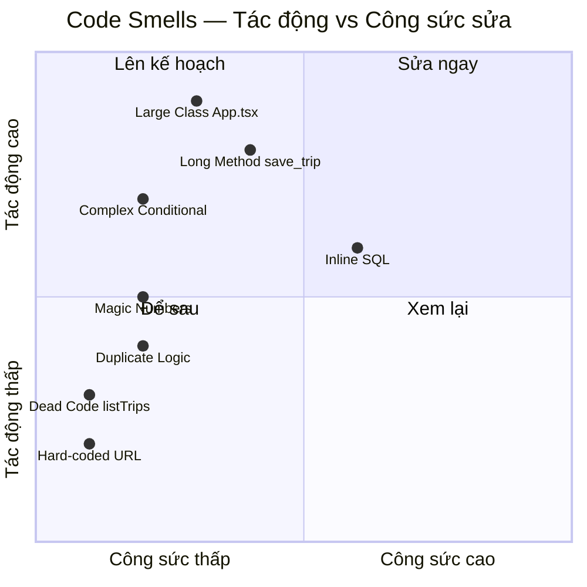

# PRD: 7.3 AI Phát hiện Code Smells (Code Smell Detection)

> **Dự án:** TripMind AI – Ứng dụng lập kế hoạch du lịch thông minh bằng AI
> **Môn học:** Chuyên đề 4: AI Product Development
> **Chương:** 7 – Tái cấu trúc & Review Mã nguồn cùng AI · Mục 7.3
> **Phiên bản:** 1.0 · **Ngày cập nhật:** 07/10/2026

## Introduction

Tài liệu này trình bày cách **AI phát hiện code smells** (mùi code — những dấu hiệu
cảnh báo trong mã nguồn có thể dẫn đến vấn đề về bảo trì, mở rộng, hoặc lỗi tiềm ẩn)
trong dự án TripMind AI. Code smell không phải là bug — code vẫn chạy được — nhưng là
chỉ báo cho thấy cần cải thiện thiết kế. AI có khả năng nhận diện nhiều loại code smell
nhanh hơn review thủ công nhờ hiểu ngữ cảnh rộng của codebase.

## Goals

- Dùng AI quét toàn bộ codebase TripMind AI để tìm code smells.
- Phân loại các smell theo danh mục (Martin Fowler's catalog).
- Đề xuất hướng xử lý cho từng smell tìm thấy.

## User Stories

### US-001: Quét code smells toàn bộ codebase
**Description:** Là một developer, tôi muốn AI quét toàn bộ code để liệt kê tất cả
code smells mà không bỏ sót.

**Acceptance Criteria:**
- [ ] Quét cả backend (Python) và frontend (TypeScript)
- [ ] Mỗi smell có tên loại, vị trí file:dòng, mô tả
- [ ] Phân loại mức độ nghiêm trọng (High/Medium/Low)

### US-002: Phân tích Long Method / Large Class
**Description:** Là một developer, tôi muốn biết hàm/class nào quá dài cần tách nhỏ.

**Acceptance Criteria:**
- [ ] Liệt kê hàm > 20 dòng
- [ ] Giải thích tại sao là vấn đề
- [ ] Gợi ý cách tách

### US-003: Phát hiện Magic Numbers và Hard-coded Values
**Description:** Là một developer, tôi muốn tìm các giá trị cứng (magic numbers) trong code.

**Acceptance Criteria:**
- [ ] Liệt kê magic numbers/strings với vị trí
- [ ] Đề xuất đặt tên constant
- [ ] Giải thích ý nghĩa của giá trị đó

## Functional Requirements

- **FR-1:** Phát hiện Long Method, Large Class, Long Parameter List.
- **FR-2:** Phát hiện Magic Numbers, Hard-coded Strings.
- **FR-3:** Phát hiện Duplicate Code, Dead Code.
- **FR-4:** Phát hiện God Class, Feature Envy.
- **FR-5:** Tổng hợp danh sách smell với mức ưu tiên.

## Non-Goals

- Không sửa code trong tài liệu này (sửa thuộc 7.2).
- Không phân tích hiệu năng (performance smell khác với code smell).

## Technical Considerations

- Tham chiếu danh mục code smell của Martin Fowler (Refactoring, 2nd Edition).
- AI nhận diện smell qua static reading — không chạy code.
- Một số smell chỉ xuất hiện khi nhìn toàn cục (God Class cần xem nhiều file).

## Success Metrics

- Tìm được ít nhất 5 code smells khác nhau.
- Mỗi smell có đủ: tên, vị trí, giải thích, đề xuất.

## Open Questions

- Smell nào nên sửa ngay, smell nào có thể chấp nhận trong demo?
- Có ngưỡng "chấp nhận được" cho từng loại smell không (ví dụ: hàm < 30 dòng là OK)?

---

## Phụ lục A – Prompt phát hiện code smells

**Prompt gửi AI:**

```
Dưới đây là toàn bộ mã nguồn backend và frontend của TripMind AI. Hãy đóng vai
code reviewer chuyên nghiệp, dùng danh mục code smells của Martin Fowler để:
1. Liệt kê tất cả code smells tìm thấy, kèm tên loại smell, vị trí (file, dòng/hàm),
   mô tả cụ thể tại sao đó là smell.
2. Phân loại mức độ: High (cần sửa sớm), Medium (nên sửa), Low (có thể để sau).
3. Đề xuất hướng refactoring cho mỗi smell.
Ưu tiên smell thực chất, tránh nitpicking phong cách code style.
```

---

## Phụ lục B – Danh sách Code Smells phát hiện được

### Tổng hợp

| # | Loại Smell | File / Vị trí | Mức độ | Đề xuất |
|---|-----------|--------------|--------|---------|
| 1 | **Long Method** | `main.py` — `save_trip()` | 🔴 High | Tách DB logic vào `db.py` |
| 2 | **Large Class (file)** | `App.tsx` — toàn file | 🔴 High | Tách thành component riêng |
| 3 | **Magic Numbers** | `ai_service.py` — cost values | 🟡 Medium | Đặt constant có tên |
| 4 | **Magic Numbers** | `config.py` — `60 * 24` | 🟡 Medium | Đặt constant `TOKEN_EXPIRE_HOURS` |
| 5 | **Dead Code (potential)** | `api.ts` — `listTrips()` | 🟡 Medium | Dùng hoặc xóa nếu không cần |
| 6 | **Duplicate Logic** | `auth.py` — encode 72 byte | 🟢 Low | Extract helper `_encode_pw()` |
| 7 | **Hard-coded URL** | `api.ts` — `BASE` constant | 🟢 Low | Đọc từ env variable |
| 8 | **Complex Conditional** | `ai_service.py` — điều kiện modulo | 🔴 High | Đơn giản hóa (đã xử lý ở 7.2) |
| 9 | **Inline SQL** | `main.py` — tất cả endpoint | 🟡 Medium | Chuyển vào repository layer |
| 10 | **God Function** | `init_db()` trong `db.py` | 🟢 Low | Tách thành từng hàm create_table_X |

---

### Chi tiết từng smell

**Smell #1 – Long Method: `save_trip()` trong `main.py`**

```python
# main.py:69-93 — hàm 24 dòng, làm 3 việc: tạo trip, tạo day_plans, tạo activities
@app.post("/api/v1/trips", status_code=201)
def save_trip(body: TripSaveIn, uid: str = Depends(current_user_id)):
    with get_conn() as conn:
        trip_id = new_id()
        conn.execute("INSERT INTO trips ...")   # việc 1
        for day in body.itinerary:
            dp_id = new_id()
            conn.execute("INSERT INTO day_plans ...")  # việc 2
            for act in day.get("activities", []):
                conn.execute("INSERT INTO activities ...")  # việc 3
```

> *AI nhận xét:* Hàm vi phạm Single Responsibility Principle — làm 3 việc DB khác nhau.
> Nên tách thành `create_trip()`, `create_day_plan()`, `create_activity()` trong `db.py`.

---

**Smell #2 – Large Class (file): `App.tsx`**

```tsx
// App.tsx — 260 dòng chứa: App, AuthForm, TripForm, ItineraryView
// Mỗi component có state riêng, logic riêng → vi phạm nguyên tắc 1 component/1 file
```

> *AI nhận xét:* File đóng vai "God File" — biết và làm quá nhiều thứ. Khó tìm kiếm,
> khó test từng component riêng lẻ.

---

**Smell #3 & 4 – Magic Numbers: cost và token expiry**

```python
# ai_service.py — giá trị cost cứng không có tên
{"name": "Ăn sáng đặc sản địa phương", "time": "07:30", "cost": 60000, "priority": "medium"},
{"name": "Ăn trưa nhà hàng nổi tiếng", "time": "12:00", "cost": 150000, "priority": "high"},

# config.py — 60 * 24 không rõ ý nghĩa ngay
ACCESS_TOKEN_EXPIRE_MINUTES = 60 * 24  # 24 giờ
```

> *AI đề xuất:*
> ```python
> # Tốt hơn:
> TOKEN_EXPIRE_HOURS = 24
> ACCESS_TOKEN_EXPIRE_MINUTES = TOKEN_EXPIRE_HOURS * 60
>
> # Cho cost trong ai_service:
> BREAKFAST_COST_VND = 60_000
> LUNCH_COST_VND = 150_000
> ```

---

**Smell #5 – Dead Code: `listTrips()` trong `api.ts`**

```ts
// api.ts:94 — hàm này được export nhưng không được gọi ở App.tsx
listTrips: () => request<Trip[]>("/trips"),
```

> *AI nhận xét:* Tính năng "Danh sách chuyến đi đã lưu" chưa được implement ở frontend.
> `listTrips()` tồn tại nhưng không được dùng — nên ghi TODO hoặc xóa.

---

**Smell #6 – Duplicate Logic: encode password**

```python
# auth.py — logic encode 72 byte xuất hiện 2 lần
def hash_password(password: str) -> str:
    pw = password.encode("utf-8")[:72]  # lần 1
    return bcrypt.hashpw(pw, bcrypt.gensalt()).decode("utf-8")

def verify_password(plain: str, hashed: str) -> bool:
    pw = plain.encode("utf-8")[:72]   # lần 2 (lặp lại)
    return bcrypt.checkpw(pw, hashed.encode("utf-8"))
```

> *AI đề xuất:* Extract helper:
> ```python
> def _encode_pw(password: str) -> bytes:
>     """Encode mật khẩu UTF-8, cắt 72 byte theo giới hạn bcrypt."""
>     return password.encode("utf-8")[:72]
> ```

---

**Smell #9 – Inline SQL: `main.py` viết SQL trực tiếp**

```python
# main.py — SQL string trực tiếp trong endpoint, không qua repository
conn.execute(
    """INSERT INTO trips (id,user_id,destination,days,budget,estimated_cost,
       preferences,status) VALUES (?,?,?,?,?,?,?, 'saved')""",
    (trip_id, uid, ...)
)
```

> *AI nhận xét:* SQL nằm rải rác ở Application Layer thay vì tập trung tại Data Layer.
> Khi cần đổi DB (ví dụ từ SQLite sang PostgreSQL), phải sửa nhiều nơi.

---

## Phụ lục C – Phân loại smell theo mức độ ưu tiên



> **Bài học:** AI rất nhanh trong việc phát hiện code smells khi có toàn bộ context.
> Tuy nhiên, **không phải smell nào cũng cần sửa ngay** — context của dự án (demo/
> production, deadline) ảnh hưởng đến mức độ ưu tiên. Con người phải phán xét
> "smell này có thực sự là vấn đề trong hoàn cảnh này không?"
