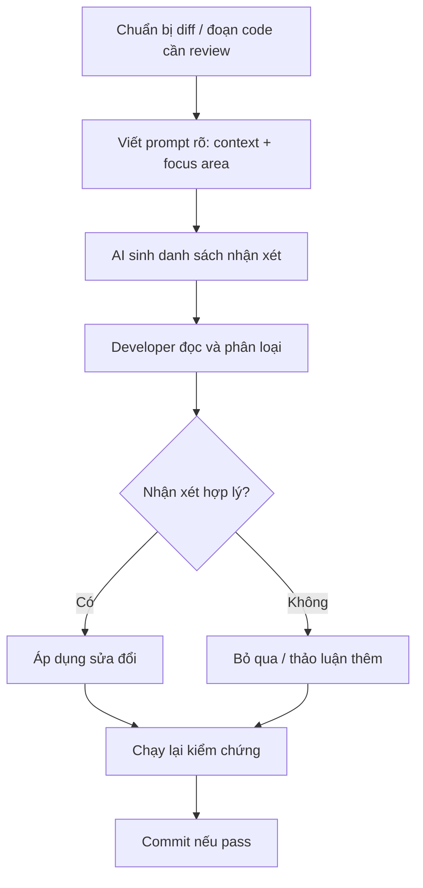

# PRD: 7.4 Review Mã nguồn bằng AI (AI Code Review)

> **Dự án:** TripMind AI – Ứng dụng lập kế hoạch du lịch thông minh bằng AI
> **Môn học:** Chuyên đề 4: AI Product Development
> **Chương:** 7 – Tái cấu trúc & Review Mã nguồn cùng AI · Mục 7.4
> **Phiên bản:** 1.0 · **Ngày cập nhật:** 07/10/2026

## Introduction

Tài liệu này trình bày quy trình **AI Code Review** — dùng AI như một "reviewer" tự động
để đánh giá mã nguồn trước khi merge/commit. Khác với phát hiện code smell (7.3) mang tính
quét toàn cục, Code Review tập trung vào từng thay đổi cụ thể (diff/PR), đánh giá tính
đúng đắn của logic, bảo mật, hiệu năng và gợi ý cải thiện — mô phỏng quy trình peer review
trong nhóm phát triển chuyên nghiệp.

## Goals

- Thực hiện AI code review cho 2 thay đổi tiêu biểu trong TripMind AI.
- Ghi lại nhận xét AI theo định dạng chuẩn (Severity, Location, Comment, Suggestion).
- Xác định ranh giới giữa AI review và human review — vai trò từng bên.

## User Stories

### US-001: AI review endpoint mới trước khi commit
**Description:** Là một developer, tôi muốn AI review endpoint `/api/v1/trips` trước
khi commit để phát hiện lỗi logic và bảo mật sớm.

**Acceptance Criteria:**
- [ ] AI đưa ra nhận xét theo từng phần của code
- [ ] Mỗi nhận xét có severity rõ ràng
- [ ] Có suggestion cụ thể (không chỉ nói "code xấu")

### US-002: AI review thay đổi frontend (priority feature)
**Description:** Là một developer, tôi muốn AI review component `ItineraryView`
để đảm bảo xử lý priority đúng và UX hợp lý.

**Acceptance Criteria:**
- [ ] Review logic filter priority
- [ ] Review optimistic update
- [ ] Phát hiện potential bug/edge case

### US-003: So sánh AI review vs Human review
**Description:** Là một người học, tôi muốn hiểu AI review bắt được gì mà human
review hay bỏ qua, và ngược lại.

**Acceptance Criteria:**
- [ ] Có bảng so sánh điểm AI bắt được và human bắt được
- [ ] Kết luận rõ ràng về vai trò từng loại review

## Functional Requirements

- **FR-1:** AI review endpoint `save_trip` (backend).
- **FR-2:** AI review component `ItineraryView` (frontend).
- **FR-3:** Tổng hợp nhận xét theo format chuẩn.
- **FR-4:** So sánh AI review vs Human review.
- **FR-5:** Quy trình AI Code Review tái sử dụng.

## Non-Goals

- Không review toàn bộ codebase (đã làm ở 7.1, 7.3).
- Không tự động áp dụng nhận xét — đây là review, không phải auto-fix.

## Technical Considerations

- AI review hiệu quả nhất khi cung cấp **diff + context** (không chỉ đoạn code cô lập).
- Định dạng nhận xét: Severity (Critical/Major/Minor/Nitpick) + Location + Comment + Suggestion.
- Human review vẫn cần thiết cho logic nghiệp vụ phức tạp và quyết định kiến trúc.

## Success Metrics

- Ít nhất 2 phiên AI review hoàn chỉnh với nhận xét có cấu trúc.
- Tìm được ít nhất 1 vấn đề thực chất (không chỉ style) qua AI review.

## Open Questions

- Nên chạy AI review trước hay sau human review?
- Làm thế nào để tránh "review fatigue" khi AI liệt kê quá nhiều nhận xét nhỏ?

---

## Phụ lục A – Phiên Review 1: Endpoint `save_trip`

**Prompt gửi AI:**

```
Hãy review đoạn code sau như một senior developer. Cho nhận xét theo format:
[Severity] File:dòng — Vấn đề — Đề xuất sửa.
Severity: Critical (lỗi runtime/security), Major (logic sai/thiếu), Minor (code quality), Nitpick (style).
Tập trung vào: correctness, security, error handling, performance.
```

**Code được review: `main.py` — hàm `save_trip`**

```python
@app.post("/api/v1/trips", status_code=201)
def save_trip(body: TripSaveIn, uid: str = Depends(current_user_id)):
    with get_conn() as conn:
        trip_id = new_id()
        conn.execute(
            """INSERT INTO trips (id,user_id,destination,days,budget,estimated_cost,
               preferences,status) VALUES (?,?,?,?,?,?,?, 'saved')""",
            (trip_id, uid, body.destination, body.days, body.budget,
             body.estimated_cost, json.dumps(body.preferences, ensure_ascii=False)),
        )
        for day in body.itinerary:
            dp_id = new_id()
            conn.execute(
                "INSERT INTO day_plans (id,trip_id,day_number) VALUES (?,?,?)",
                (dp_id, trip_id, day["day"]),
            )
            for act in day.get("activities", []):
                conn.execute(
                    """INSERT INTO activities (id,day_plan_id,name,time,location,cost,priority)
                       VALUES (?,?,?,?,?,?,?)""",
                    (new_id(), dp_id, act["name"], act.get("time"), act.get("location"),
                     act.get("cost", 0), act.get("priority", "medium")),
                )
    return {"success": True, "data": {"id": trip_id}}
```

**Kết quả AI Review:**

| Severity | Vị trí | Vấn đề | Đề xuất |
|----------|--------|--------|---------|
| 🔴 **Major** | `main.py:86` | `day["day"]` dùng `[]` thay `get()` — raise `KeyError` nếu key vắng mặt | Dùng `day.get("day", day_index)` hoặc validate schema với Pydantic |
| 🔴 **Major** | `main.py:88-92` | `act["name"]` không có `.get()` — crash nếu activity thiếu `name` | Dùng `act.get("name", "Hoạt động")` hoặc thêm validation |
| 🟡 **Minor** | `main.py:69-93` | Hàm 24 dòng vi phạm SRP — làm 3 việc DB cùng lúc | Tách `insert_trip()`, `insert_day_plan()`, `insert_activity()` vào `db.py` |
| 🟡 **Minor** | `main.py:78` | `json.dumps(ensure_ascii=False)` — preferences lưu dạng string JSON, đọc lại cần parse | Ghi chú comment hoặc đảm bảo khi đọc lại có `json.loads()` |
| 🟢 **Nitpick** | `main.py:75` | Status `'saved'` là hard-coded string | Dùng constant `TRIP_STATUS_SAVED = "saved"` |

**Nhận xét quan trọng nhất (Major — lỗi tiềm ẩn):**

```python
# TRƯỚC — có thể crash KeyError
for day in body.itinerary:
    conn.execute("INSERT INTO day_plans ...", (dp_id, trip_id, day["day"]))

# SAU — an toàn hơn
for idx, day in enumerate(body.itinerary, start=1):
    day_num = day.get("day", idx)  # fallback về thứ tự nếu thiếu "day"
    conn.execute("INSERT INTO day_plans ...", (dp_id, trip_id, day_num))
```

---

## Phụ lục B – Phiên Review 2: Component `ItineraryView` (Frontend)

**Code được review: `App.tsx` — hàm `changePriority` và filter logic**

```tsx
async function changePriority(act: Activity, priority: string) {
  // Cập nhật lạc quan trên UI; nếu đã lưu (có id) thì gọi API.
  setItin((cur) => ({
    ...cur,
    itinerary: cur.itinerary.map((day) => ({
      ...day,
      activities: day.activities.map((a) =>
        (a === act ? { ...a, priority: priority as Activity["priority"] } : a)
      ),
    })),
  }));
  if (act.id) {
    try {
      await api.updatePriority(act.id, priority);
    } catch (err) {
      onError((err as Error).message);
    }
  }
}
```

**Kết quả AI Review:**

| Severity | Vị trí | Vấn đề | Đề xuất |
|----------|--------|--------|---------|
| 🔴 **Major** | `App.tsx:173` | So sánh `a === act` (referential equality) — sau khi state update, reference có thể khác | Dùng `a.name === act.name && a.time === act.time` hoặc dùng `id` nếu có |
| 🔴 **Major** | `App.tsx:180-186` | Optimistic update không rollback nếu API lỗi — UI hiển thị priority mới nhưng DB vẫn cũ | Thêm rollback: lưu state cũ, restore nếu API lỗi |
| 🟡 **Minor** | `App.tsx:167` | `filter === "all"` là string so sánh với giá trị enum — dễ typo | Dùng type: `type Filter = "all" \| "high" \| "medium" \| "low"` |
| 🟢 **Nitpick** | `App.tsx:171` | `priority: string` — nên là `priority: Activity["priority"]` cho type safety | Thêm type annotation chặt hơn |

**Vấn đề Optimistic Update (Major) — chi tiết:**

```tsx
// TRƯỚC — không rollback khi lỗi
async function changePriority(act: Activity, priority: string) {
  setItin(/* update ngay */);         // UI cập nhật
  if (act.id) {
    try { await api.updatePriority(act.id, priority); }
    catch (err) { onError(err.message); }  // báo lỗi nhưng UI vẫn sai
  }
}

// SAU — có rollback
async function changePriority(act: Activity, priority: string) {
  const prevItin = itin;              // lưu state cũ
  setItin(/* update ngay */);         // optimistic update
  if (act.id) {
    try { await api.updatePriority(act.id, priority); }
    catch (err) {
      setItin(prevItin);              // rollback nếu API lỗi
      onError(err.message);
    }
  }
}
```

---

## Phụ lục C – So sánh AI Review vs Human Review

| Loại vấn đề | AI Review | Human Review |
|-------------|:---------:|:------------:|
| KeyError tiềm ẩn (`day["day"]`) | ✅ Bắt được | ⚠️ Dễ bỏ qua |
| Optimistic update thiếu rollback | ✅ Bắt được | ✅ Bắt được |
| Referential equality `a === act` | ✅ Bắt được | ⚠️ Cần kinh nghiệm |
| Magic numbers / style | ✅ Rất chi tiết | ⚠️ Hay bỏ qua |
| Quyết định kiến trúc (tách layer) | ⚠️ Gợi ý chung | ✅ Hiểu context sâu |
| Tính đúng đắn logic nghiệp vụ | ⚠️ Cần context domain | ✅ Hiểu rõ hơn |
| Security (SQL injection, JWT) | ✅ Nhạy với pattern phổ biến | ✅ Tốt |
| UX / Accessibility | ❌ Không đánh giá được | ✅ Tốt hơn |

**Kết luận:** AI review và human review **bổ sung cho nhau**:
- AI nhanh, không mệt, phát hiện tốt pattern lỗi phổ biến (KeyError, missing rollback, type safety).
- Human review cần thiết cho logic nghiệp vụ phức tạp, quyết định kiến trúc, và UX.

---

## Phụ lục D – Quy trình AI Code Review



**Checklist trước khi commit sau AI review:**

```
□ Đã đọc và hiểu từng nhận xét AI
□ Critical/Major đã được xử lý (sửa hoặc có lý do bỏ qua)
□ Minor/Nitpick đã cân nhắc (không bắt buộc sửa hết)
□ Chạy lại app thủ công, đảm bảo không phá vỡ tính năng cũ
□ Nếu có thay đổi logic, kiểm tra edge case
```

| Bước | Vai trò AI | Vai trò con người |
|------|-----------|-------------------|
| Chuẩn bị code review | – | Chọn đoạn cần review |
| Phân tích và nhận xét | Liệt kê vấn đề với severity | – |
| Phán xét nhận xét | – | **Quyết định cái nào sửa** |
| Áp dụng sửa đổi | Gợi ý code sửa | Review và áp dụng |
| Kiểm chứng | – | **Chạy lại, xác nhận** |

> **Bài học:** AI Code Review hiệu quả nhất khi được **định hướng rõ focus area**
> (bảo mật, performance, correctness). Prompt chung chung sinh ra nhận xét chung chung.
> Nên dùng AI review làm lớp kiểm tra đầu tiên trước human review — tiết kiệm thời gian
> reviewer con người cho những vấn đề thực chất hơn là style/syntax.
